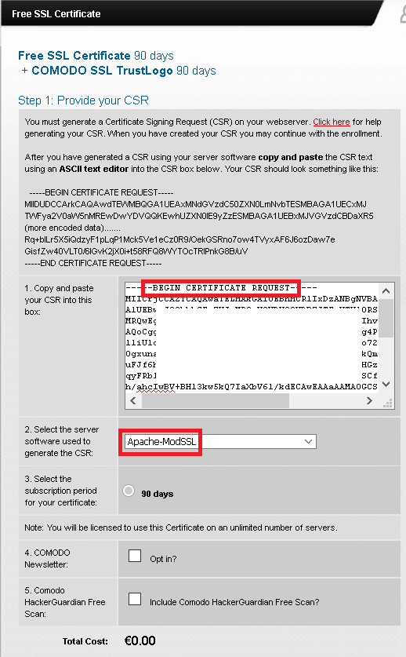
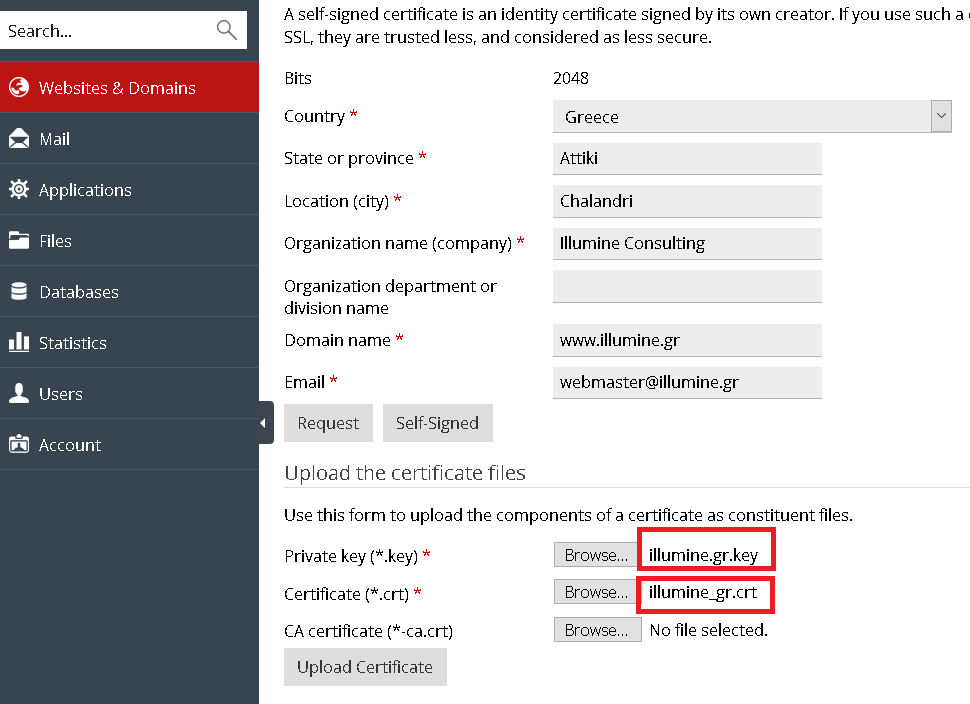
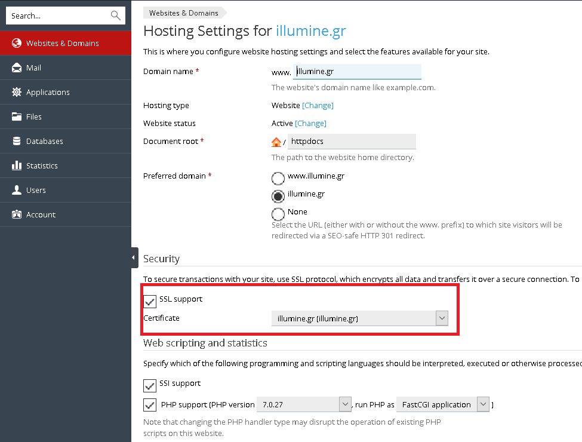
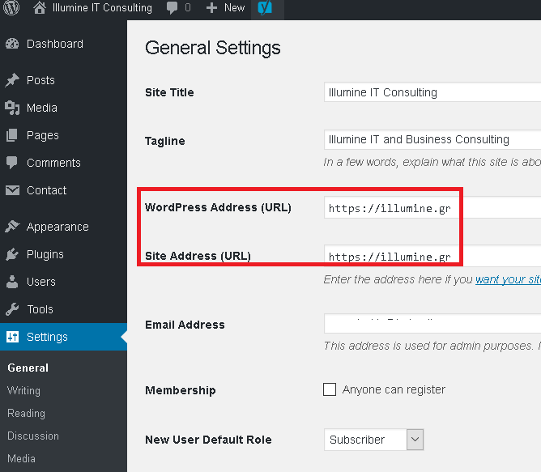

# Enable SSL for your Wordpress/Plesk site using a free authority-signed certificate 

Example site: illumine.gr runing on Wordpress/Plesk

**Step 1:  Create your server's private key and certificate sign request files.**       
To do so, you have to install [Openssl tools](https://www.openssl.org/) in your Linux server.    
Normally,  [Openssl tools](https://www.openssl.org/) will come with your Linux distribution, so you just have to install them using your system's package manager. For my SLES machine, I just have to do
<pre>
 #  zypper install openssl
 ....
 #  which  openssl
/usr/bin/openssl
</pre>

and issue the following `openssl` command:

<pre>
# openssl  req -new -newkey rsa:2048 -days 3652 \
        -subj "/C=GR/ST=Attica/L=Chalandri/O=ILLUMINE-IT-CONSULTING/CN=illumine.gr" \
       -newkey rsa:2048 -nodes -keyout illumine.gr.key \
       -out illumine.gr.csr 
       
 # ls -l
total 8
-rw-r--r-- 1 root root 1005 Feb  1 10:04 illumine.gr.csr
-rw-r--r-- 1 root root 1704 Feb  1 10:04 illumine.gr.key       
</pre>

The first one   `illumine.gr.csr` is the certificate sign request file. This will be later passed to the Trusted Authority in order to create our server certificate.

The second one `illumine.gr.key` is the domain private key file that will be setup in the Apache HTTP server configurtion of our site.

**Step 2: Create an authority signed server certificate**    

Let's see what is the main difference between a *self-signed* and an *authority-signed* server certificate.    
With a *self-signed* you just state that you are your domain - we don't actually know if you are or not.  Noone will support the contrary, but our web browser will issue a warning when we will try to access your site.

On the other hand, an *authority-signed* server certificate includes the Trusted Authority's digital signature that your domain **is actually what it says it is!**, in other words, the Trusted Authority prooves that indeed you are this domain you claim to be. In this case our web browser will not isse a warning when we will try to access your site.

In order to create an  authority signed server certificate  you normally have to pay some money to the Authority.     
With a little help from [duckduckgo search engine](https://duckduckgo.com/) I found that the guys in [Comodo Cyber Security](https://comodo.com) provide a service to create a **90 days free trial** *authority-signed* server certificate.   

In order to create one go to  [https://ssl.comodo.com/free-ssl-certificate.php](https://ssl.comodo.com/free-ssl-certificate.php) and paste your certificate sign request file. In our case is the file:  `illumine.gr.csr`  we created in step1.

Make sure to select the Apache-ModSSL as the software to be used to generate the CSR. We select that one, since we are using Apache as our HTTP server.

 [Comodo Cyber Security](https://comodo.com) will then ask you to create a certificate manager account that will be used in order to re-issue the certificates or change some attributes.  Doing so, you will have to provide a valid email address so that Comodo will send you an email with the certificate verification code.
 
 When you enter the verification code from Comodo email, a new email will be sent with attached the compressed authority signed certificate for your domain. Save the certificates in a really safe directory on your server.

**Step 3: Enable the Certificate in Plesk**
Login to your domain's Plex dashboard.   Then navigate to           
*Websites & Domains -> illumine.gr -> SSL Certificates*   and then upload the authority signed certificate and the server key that you have used to create it.

Next, you have to use this certificate for your site. Navigate to :     
*Websites & Domains -> Hosting Settings* and indicate the certificate you previously added.

**Step 4: Configure Wordpress to load the page using HTTPS**
Go to your site's Wordpress admin panel. Navigate to:    
*Settings -> General Settings* and change the parameters *WordPress Address (URL)* and *Site Address (URL)* to utilize HTTPS instead of HTTP.

**Step 5: Redirect HTTP to HTTPS using .htaccess**
Now you have to ensure that your site will be accessed only using HTTPS. To do so, edit file `httpdocs/.htaccess` and place the following Apache redirection instructions:

<pre>
# BEGIN WordPress
&lt;IfModule mod_rewrite.c&gt;
RewriteEngine On
RewriteCond %{SERVER_PORT} 80 
RewriteRule ^(.*)$ https://www.illumine.gr/$1 [R,L]
&lt;/IfModule&gt;

# END WordPress
</pre>

Finally, edit file `httpdocs/wp-config.php` and add the following code above the “That’s all, stop editing!” line in your `httpdocs/wp-config.php` file:
<pre>
define('FORCE_SSL_ADMIN', true);
</pre>

**Step 6: Test your site with various browsers**          
You should use Chrome, Firefox and Internet Explorer to verify that your site works as expected.
 
**Step 7: Re-backup Wordpress files**                    
Create another compressed archive of the conetents of `httpdocss` directory. 

[Follow us on LinkedIn](https://www.linkedin.com/company/illumine-it-consulting/)[Read our Blog](https://illumineconsulting.blogspot.com/)[Find us on Google+](https://plus.google.com/+IllumineGr1/)    
