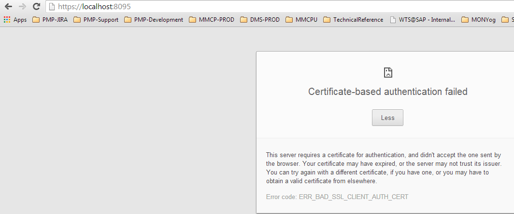

# Implementing 2-way SSL in Java using TLS and Self Signed Certificates part1: Keystore-Trustsore
Consider that we want to implement in Java a secure communication [Transport Layer Security](https://en.wikipedia.org/wiki/Transport_Layer_Security) for a system called `MySystem`.

## The problem

The security scenario for the implementation of  `MySystem` is simple: \
Authentication only between peers that both share the Keystore/Trustore file \
Session establishment only between peers that have the Keystore/Trustore file \
Doing so, the entire communication between client and server requires authentication and is encrypted:

 

## What is proposed
To implement the scenario, there are three basic steps: 

* Create the Java Keystore/Trustore that will be used for Authentication and Encryption of Transport/Session. This will be used from both Client and Server parties. (Current Part) \
* Implement the Server side: Server implemented in [Part-2](part-2-the-java-server.md)
* Implement the Client side:  Client implemented in [Part-3](part-3-the-java-client.md)
* Debug client/server: [Part-4](part-4-test-java-tls-client-server.md)

**Step 1:** Create the Keystore/Trustore \
Following steps of this section, results in the creation of a  Keystore/Trustore .jks file that contains: \
MySystem Private key \
MySystem Selfsigned Certificate \
To do so we are going to use the tools openssl  and keytool. We prefer using openssl because it can work silently - without prompt the user to put passwords, domains, server names....

The steps are:
1. Generate RSA 1024 bit private key. The key will be password protected: \
`openssl genrsa -out mysystem.key 1024 -passin pass:welcome`

2. Generate Certificate Request for CA (.csr) using the private key \
`openssl req -x509 -sha256 -new -subj '/C=GR/ST=Athens/L=Chalandri/CN=mysystem'  -key mysystem.key -out mysystem.csr`

3.  Generate self signed certificate expiry-time 10 years from the certificate request \
`openssl x509 -sha256 -days 3652 -in mysystem.csr -signkey mysystem.key -out mysystem.crt`

4.  Import the pair (private key and selfsigned certificate) in a new JKS (Trustore/Keystore together) \
First we need to create PKCS12 keystore from private key and self signed certificate. \
`openssl pkcs12 -export -name mysystem -in mysystem.crt -inkey mysystem.key -out mysystem.p12 -passin pass:welcome -password pass:welcome`

Then we need to convert PKCS12 keystore into a JKS keystore\
`keytool -importkeystore -destkeystore mysystem.jks -srckeystore mysystem.p12 -srcstoretype pkcs12 -alias mysystem -srcstorepass welcome  -storepass welcome  -noprompt`

At this point we have created the Java  Keystore/Trustore mysystem.jks file.

Copy mysystem.jks on both client and server machines.

[Download all the commands for the Keystore/Trustore .jks file generation here](keystores.sh)
