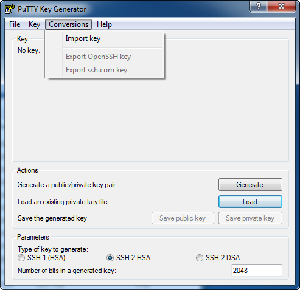
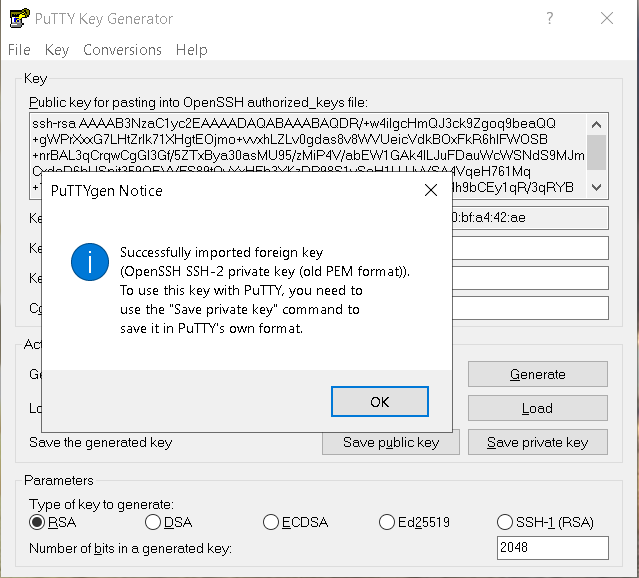
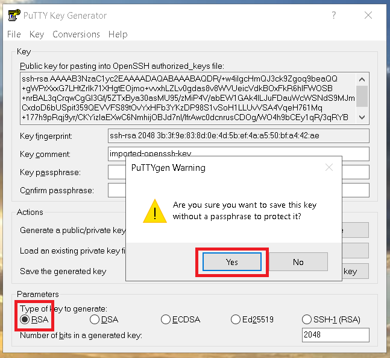
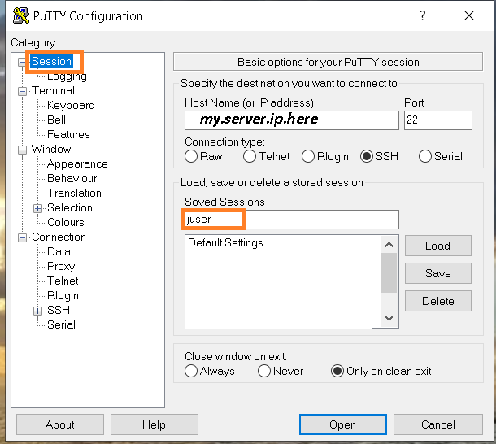
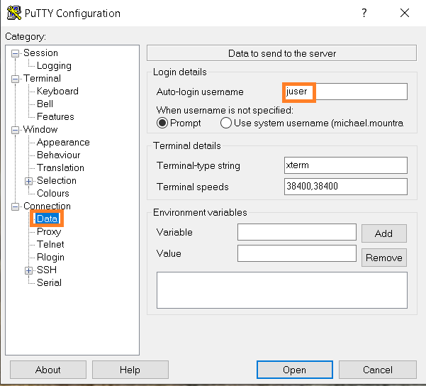
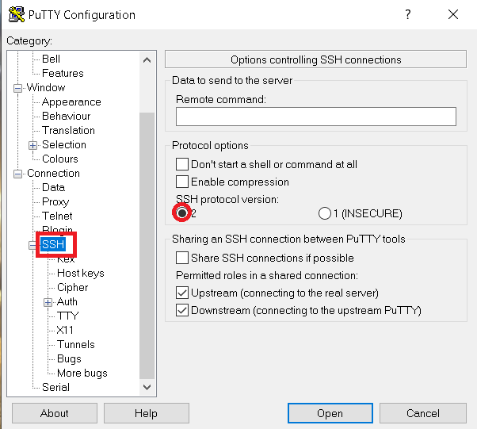
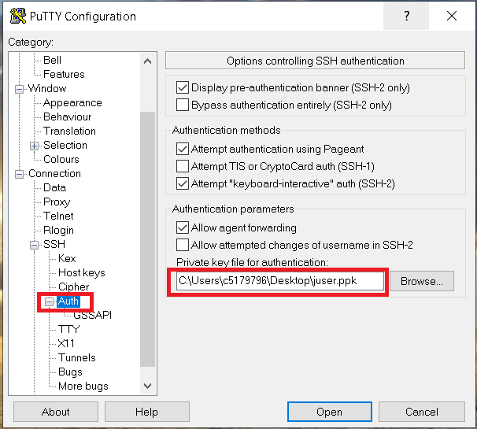
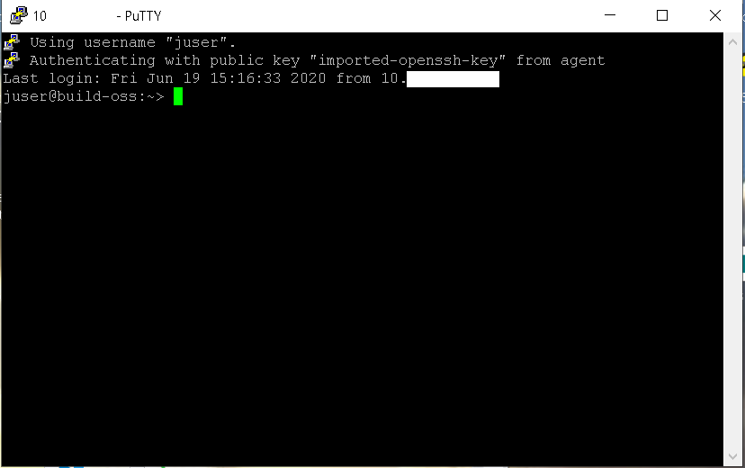

# Creating and Deleting Users
_Michael Mountrakis, June 2020_

## Create the new user
This can be done with linux root command `useradd`:


```bash
ccloud@build-oss:~> sudo -i
build-oss:~ #

build-oss:~ # useradd juser -d /home/juser -m -g 100 -s /bin/bash
```

The first command is to become super user so we can use the `useradd` command

The second command creates a new user that belongs to group 100 has `/home/juser` as his home directory and uses
`/bin/bash`. The option `-m` specifies that the `/home/juser` should be also created. 

Now let´s check the results of the commands:

```bash
build-oss:~ # ls -l /home
total 8
drwxr-xr-x 7 juser  users 4096 Jun 19 13:16 juser

build-oss:~ # cat /etc/passwd | grep juser
juser:x:1000:100::/home/juser:/bin/bash
```

The `useradd` command adds an entry to the 	`/etc/passwd`, `/etc/shadow`, `/etc/group` and `/etc/gshadow` files.

Now the new `juser` must be able to login. To do so, lets give him a password:

```bash
build-oss:~ # sudo passwd juser
New password:
Retype new password:
passwd: password updated successfully
```
Lets try to see if the user can ssh to the machine:

```bash
build-oss:~ # su juser
juser@build-oss:/root> cd
juser@build-oss:~> ssh localhost
The authenticity of host 'localhost (::1)' can't be established.
ECDSA key fingerprint is SHA256:AWj0J1U2eoaw3tV446cID5Xf1/3dumn5aMF+rFJw1og.
Are you sure you want to continue connecting (yes/no)? yes
Warning: Permanently added 'localhost' (ECDSA) to the list of known hosts.
Password:
Last failed login: Fri Jun 19 13:38:44 UTC 2020 from ::1 on ssh:notty
There was 1 failed login attempt since the last successful login.
juser@build-oss:~>
```


## Adding private and public keys for the user

Do this with the following commands:

```bash
build-oss:~ # su juser
juser@build-oss:/root> cd
juser@build-oss:~>

juser@build-oss:~> mkdir .ssh
juser@build-oss:~> chmod 700 .ssh
juser@build-oss:~> cd .ssh/
juser@build-oss:~/.ssh> ssh-keygen -t rsa -C "juser@illumineit.com"
Generating public/private rsa key pair.
Enter file in which to save the key (/home/juser/.ssh/id_rsa):
Enter passphrase (empty for no passphrase):
Enter same passphrase again:
Your identification has been saved in /home/juser/.ssh/id_rsa.
Your public key has been saved in /home/juser/.ssh/id_rsa.pub.
The key fingerprint is:
SHA256:gSAeUazRKH0CGjz2inIGlCyvHOEdB8bw3QaX4tElmOA juser@illumineit.com
The key's randomart image is:
+---[RSA 2048]----+
|=+BX=.+oo.       |
|+@O==B++.        |
|*o*E+.+o.        |
|.ooo ..  .       |
|ooo     S        |
|+oo              |
|.o               |
|                 |
|                 |
+----[SHA256]-----+
juser@build-oss:~/.ssh> ls -l
total 8
-rw------- 1 juser users 1675 Jun 19 13:18 id_rsa
-rw-r--r-- 1 juser users  408 Jun 19 13:18 id_rsa.pub
```
File `id_rsa` is the RSA public key, and `id_rsa.pub` is the public key.

Now in order the user to be able to login to the host with his public key, do

```bash
juser@build-oss:~/.ssh> cp id_rsa.pub authorized_keys
juser@build-oss:~/.ssh> chmod 600 authorized_keys
juser@build-oss:~/.ssh> ssh localhost
Last failed login: Fri Jun 19 14:00:48 UTC 2020 from ::1 on ssh:notty
juser@build-oss:~>
```

For security reasons, you may want to delete the private key from this host and leave only the public key.


## Connecting to the Linux host from a Windows machine
Copy `juser` private and public keys `/home/juser/.ssh/id_rsa`  and `/home/juser/.ssh/id_rsa.pub` 
 to your windows machine. To copy it you can use the
[WinSCP free tool](https://winscp.net/eng/download.php) 


### Convert the private key into PUTTY’s ppk format
Download and open the program puttygen.exe and open menu item 
'Conversions’ and then select option 'Import key’.



Select the private key file id_rsa.







Click on the button Save private key and save the private key in the ppk format to C:\Users\<myuser>\.ssh\juser.ppk.

Ultimately, the .ssh folder in the user home folder on your computer has three key files:

The idrsa file contains your private key in the OpenSSH format.

The idrsa.pub file contains your public key in the OpenSSH format.

The .ppk file contains your private key in PuTTY’s own format.


Note If your home drive is not located on drive C: copy the files to the user home on your home drive.


Then download configure the [PyTTY tool](https://www.chiark.greenend.org.uk/~sgtatham/putty/latest.html)

### Configure PuTTY on the Windows machine
To configure PyTTY, make it read the `juser.ppk` private key that you previously converted.

Open the program putty.exe. Select the Default Settings profile in the 
`Load, save or delete a stored session’ section of the application and click 
Load to load the stored configuration of this profile.

**Note:** Depending on how the `Default Settings’ profile was previously configured and saved, 
it may appear that nothing happened when `Load’ was clicked, however, something may have been loaded in the 
background in one of the many other screens of the profile.













Then **Save** the  PyTTY  `juser` session in order not to reconfigure everything from the beggining. 

Finally **Open** the session to the host.




## Deleting the user

```bash
build-oss:~ # userdel juser
no crontab for juser
build-oss:~ # ls -l /home
total 8
drwxr-xr-x 7   1000 users 4096 Jun 19 13:16 juser
build-oss:~ # rm -rf /home/juser
```

## Resources

https://www.ssh.com/ssh/keygen/

http://www.openssh.com/

https://linux.die.net/man/8/useradd