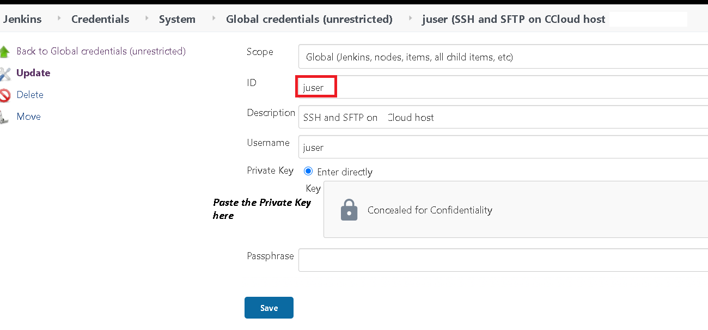

# Linux Authentication and Access
_Michael Mountrakis, June 2020_


#### Abstract
A small briefing that covers the basic points of creating a new user in a Linux host. We start with a simple username/password 
old and insecure authentication method and then we add RSA certificate to  make the user authentication modern and more robust. 
In the second section, we copy the private key to our windows machine and we configure windows PuTTY so that we connect to the 
Linux server using rSA certificates. 
In the last section we introduce we introduce  a simple Jenkins pipeline that demonstrates the use of  the 
`sftp` and `ssh` commands for the linux user we previously created. 
Just 10 minutes reading.


## Create the new user that authenticates with Username/Password
This can be done with linux root command `useradd`:


```bash
ccloud@build-oss:~> sudo -i
build-oss:~ #

build-oss:~ # useradd juser -d /home/juser -m -g 100 -s /bin/bash
```

The first command is to become super user so we can use the `useradd` command

The second command creates a new user that belongs to group 100 has `/home/juser` as his home directory and uses
`/bin/bash`. The option `-m` specifies that the `/home/juser` should be also created. 

Now let´s check the results of the commands:

```bash
build-oss:~ # ls -l /home
total 8
drwxr-xr-x 7 juser  users 4096 Jun 19 13:16 juser

build-oss:~ # cat /etc/passwd | grep juser
juser:x:1000:100::/home/juser:/bin/bash
```

The `useradd` command adds an entry to the 	`/etc/passwd`, `/etc/shadow`, `/etc/group` and `/etc/gshadow` files.

Now the new `juser` must be able to login. To do so, lets give him a password:

```bash
build-oss:~ # sudo passwd juser
New password:
Retype new password:
passwd: password updated successfully
```
Lets try to see if the user can ssh to the machine:

```bash
build-oss:~ # su juser
juser@build-oss:/root> cd
juser@build-oss:~> ssh localhost
The authenticity of host 'localhost (::1)' can't be established.
ECDSA key fingerprint is SHA256:AWj0J1U2eoaw3tV446cID5Xf1/3dumn5aMF+rFJw1og.
Are you sure you want to continue connecting (yes/no)? yes
Warning: Permanently added 'localhost' (ECDSA) to the list of known hosts.
Password:
Last failed login: Fri Jun 19 13:38:44 UTC 2020 from ::1 on ssh:notty
There was 1 failed login attempt since the last successful login.
juser@build-oss:~>
```


## Adding  RSA private and public keys for the user

Yes but... this is old school... I remember myself doing this since 1990... Now it is the era of [MFA](https://en.wikipedia.org/wiki/MFA)
we cannot afford still having the same authentication since 90s.

To change this, we can add a public and private key to our authentication scheeme, enabling in such a 
way _[asymmetric cryptography](https://en.wikipedia.org/wiki/Public-key_cryptography)_ to the authentication and session.

First of all, create the `.ssh` directory for the `juser` in order 
to store his key and certificate/public.key

Secondly, we have to use the [ssh-keygen tool](https://www.ssh.com/ssh/keygen/) in orderf to create a public and private [RSA key](https://en.wikipedia.org/wiki/RSA_(cryptosystem)).

We can do this with the following commands. 

```bash
build-oss:~ # su juser
juser@build-oss:/root> cd
juser@build-oss:~>

juser@build-oss:~> mkdir .ssh
juser@build-oss:~> chmod 700 .ssh
juser@build-oss:~> cd .ssh/
juser@build-oss:~/.ssh> ssh-keygen -t rsa -C "juser@illumineit.com"
Generating public/private rsa key pair.
Enter file in which to save the key (/home/juser/.ssh/id_rsa):
Enter passphrase (empty for no passphrase):
Enter same passphrase again:
Your identification has been saved in /home/juser/.ssh/id_rsa.
Your public key has been saved in /home/juser/.ssh/id_rsa.pub.
The key fingerprint is:
SHA256:gSAeUazRKH0CGjz2inIGlCyvHOEdB8bw3QaX4tElmOA juser@illumineit.com
The key's randomart image is:
+---[RSA 2048]----+
|=+BX=.+oo.       |
|+@O==B++.        |
|*o*E+.+o.        |
|.ooo ..  .       |
|ooo     S        |
|+oo              |
|.o               |
|                 |
|                 |
+----[SHA256]-----+
juser@build-oss:~/.ssh> ls -l
total 8
-rw------- 1 juser users 1675 Jun 19 13:18 id_rsa
-rw-r--r-- 1 juser users  408 Jun 19 13:18 id_rsa.pub
```
File `id_rsa` is the RSA public key, and `id_rsa.pub` is the public key.

Now in order the user to be able to login to the host with his public key, do

```bash
juser@build-oss:~/.ssh> cp id_rsa.pub authorized_keys
juser@build-oss:~/.ssh> chmod 600 authorized_keys
juser@build-oss:~/.ssh> ssh localhost
Last failed login: Fri Jun 19 14:00:48 UTC 2020 from ::1 on ssh:notty
juser@build-oss:~>
```

For security reasons, **you may want to delete the private key from this host** and leave only the public key.
In general as a rule of thump: your private key stays only in your machine, 
while in the server you connect only the public key should exists.


## Connecting to the Linux host from a Windows machine
Copy `juser` private and public keys `/home/juser/.ssh/id_rsa`  and `/home/juser/.ssh/id_rsa.pub` 
 to your windows machine. To copy it you can use the
[WinSCP free tool](https://winscp.net/eng/download.php) 


Certificates is just encrypted ANSI text, so you can copy paste their contect 
and save them to a local file in your windows machine as long as the EOL (End of Line) is preserved..


### Convert the private key into PUTTY’s ppk format
Download and open the program puttygen.exe and open menu item 
'Conversions’ and then select option 'Import key’.


Select the private key file id_rsa.


Click on the button Save private key and save the private key in the ppk format to C:\Users\<myuser>\.ssh\juser.ppk.

Ultimately, the .ssh folder in the user home folder on your computer has three key files:

The idrsa file contains your private key in the OpenSSH format.

The idrsa.pub file contains your public key in the OpenSSH format.

The .ppk file contains your private key in PuTTY’s own format.


Note If your home drive is not located on drive C: copy the files to the user home on your home drive.


Then download configure the [PyTTY tool](https://www.chiark.greenend.org.uk/~sgtatham/putty/latest.html)

### Configure PuTTY on the Windows machine
To configure PyTTY, make it read the `juser.ppk` private key that you previously converted.

Open the program putty.exe. Select the Default Settings profile in the 
`Load, save or delete a stored session’ section of the application and click 
Load to load the stored configuration of this profile.

**Note:** Depending on how the `Default Settings’ profile was previously configured and saved, 
it may appear that nothing happened when `Load’ was clicked, however, something may have been loaded in the 
background in one of the many other screens of the profile.


Then **Save** the  PyTTY  `juser` session in order not to reconfigure everything from the beggining. 

Finally **Open** the session to the host.


### Invoking `ssh, scp, sftp` commands with Jenkins

Jenkins is a build tool. It can be used when CI/CD ir required for your projects in addition with 
the build tools like Ant, Maven, C/C++ Make.


Here is an example of a simple groovy pipeline that it utilizes the SSH commands `ssh, scp, sftp`.

First of all copy and store the private key id_rsa to Jenkins Credentials




Then a very simple pipeline that invokes `ssh, scp, sftp` commands can be the following one:

```groovy
pipeline {
    agent any
    stages {
        stage('sshUserPrivateKey') {
            steps {
                script {
                    withCredentials([
                        sshUserPrivateKey(
                            credentialsId: 'juser',
                            keyFileVariable: 'keyFile',
                            usernameVariable: 'username')
                    ]) {
                            print 'keyFile=' + keyFile
                            print 'username=' + username
            
                            keyFileContent = readFile(keyFile)
                            writeFile file: 'id.rsa',  text: keyFileContent
         
                            sh '''
                            today=$(date +"%Y-%m-%d")
                            sftp -v  -i id.rsa juser@illumineit.com    <<EOF
								get $today/backup.tgz  $today_backup.tgz
								quit
							EOF
                            ssh -v  -i id.rsa juser@illumineit.com << EOF
								./run_cleanup.sh  $today
							EOF                   
                            '''
                        }
                }
            }
        }  
    }  
}
```
All seems ok, but the pipeline script fails with the error:
```
ebug1: SSH2_MSG_SERVICE_ACCEPT received
debug1: Authentications that can continue: publickey,keyboard-interactive
debug1: Next authentication method: publickey
debug1: Trying private key: id.rsa
@@@@@@@@@@@@@@@@@@@@@@@@@@@@@@@@@@@@@@@@@@@@@@@@@@@@@@@@@@@
@         WARNING: UNPROTECTED PRIVATE KEY FILE!          @
@@@@@@@@@@@@@@@@@@@@@@@@@@@@@@@@@@@@@@@@@@@@@@@@@@@@@@@@@@@
Permissions 0644 for 'id.rsa' are too open. <-----------------------------------BEWARE!!
It is required that your private key files are NOT accessible by others.
This private key will be ignored.
Load key "id.rsa": bad permissions
debug1: Next authentication method: keyboard-interactive
debug1: read_passphrase: can't open /dev/tty: No such device or address
debug1: Authentications that can continue: publickey,keyboard-interactive
debug1: read_passphrase: can't open /dev/tty: No such device or address
debug1: Authentications that can continue: publickey,keyboard-interactive
debug1: read_passphrase: can't open /dev/tty: No such device or address
debug1: Authentications that can continue: publickey,keyboard-interactive
debug1: No more authentication methods to try.
****@illumineit.com: Permission denied (publickey,keyboard-interactive). 
```

In case you dont specify the `-v` debug flag in `ssh or sftp` the error is even much more mysterious:
**Host key verification failed.**

"Why?" you might question yourself.... "I copied/paste the private key... it just can't be really wrong.... What is it wrong with it?"


The mysterious error here is that the key file 'id.rsa'  has the default unix permissions 644 when it is created from the
call `writeFile file: 'id.rsa',  text: keyFileContent` 


To amend the situation, we modify the script by adding the `chmod 600 id.rsa` call so that the proper secret file 
permissions must be applied.

```groovy
 writeFile file: 'id.rsa',  text: keyFileContent
 sh '''
     chmod 600 id.rsa 
     sftp -v  -i id.rsa juser@illumineit.com      
```

and the pipeline excecutes normally!


## Deleting the linux user

```bash
build-oss:~ # userdel juser
no crontab for juser
build-oss:~ # ls -l /home
total 8
drwxr-xr-x 7   1000 users 4096 Jun 19 13:16 juser
build-oss:~ # rm -rf /home/juser
```
First command deletes the user but it leaves untuched his home directory.


Second command deletes also the home contents..

## Resources

https://www.ssh.com/ssh/keygen/

http://www.openssh.com/

https://linux.die.net/man/8/useradd