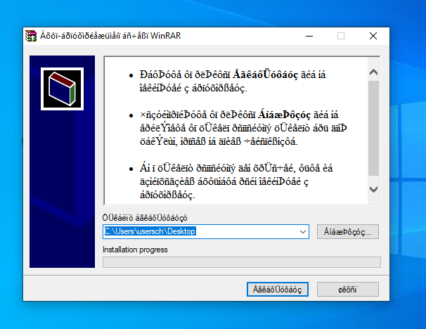
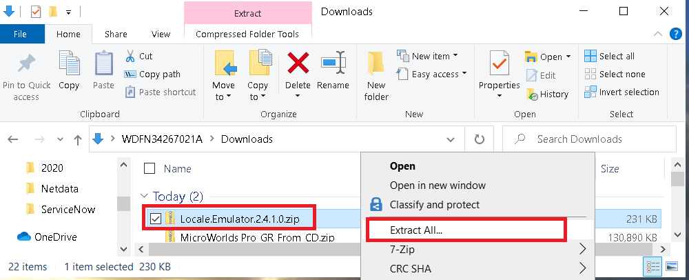
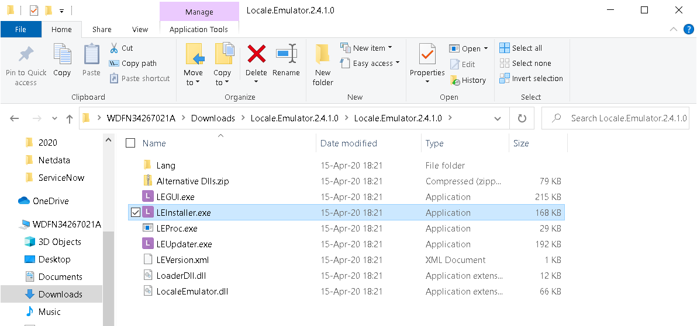
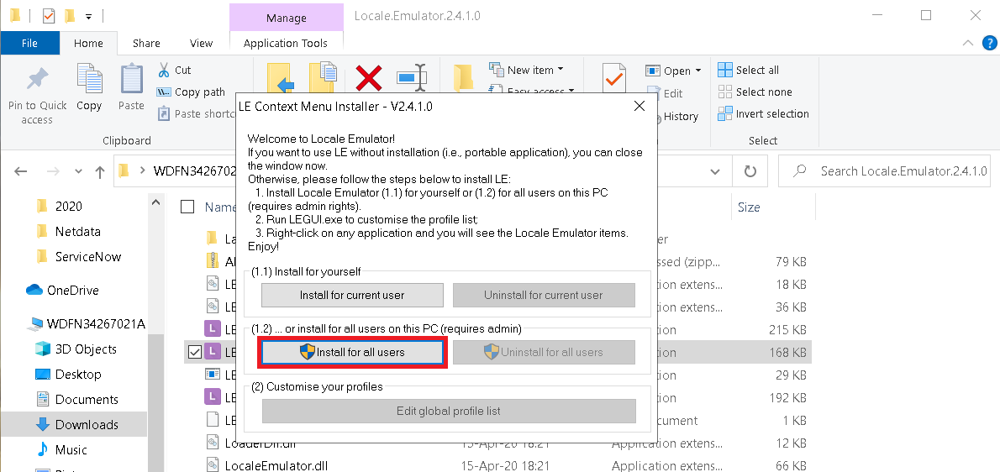
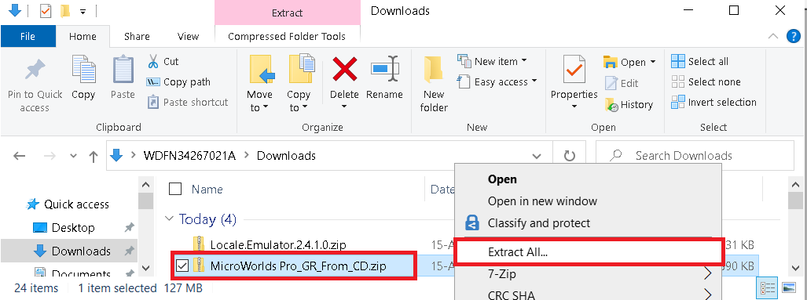
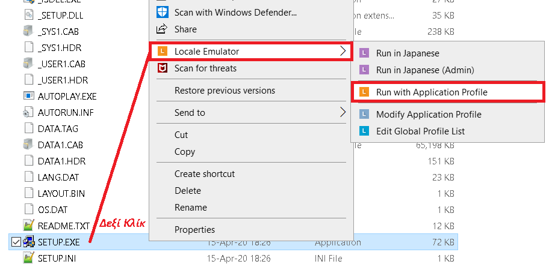
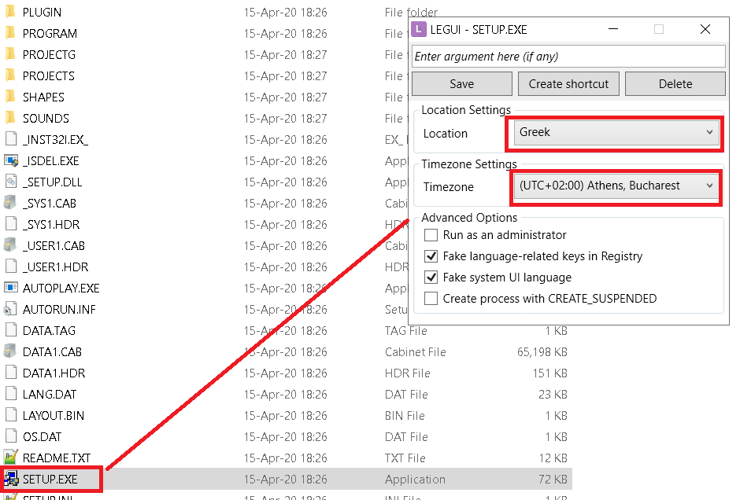
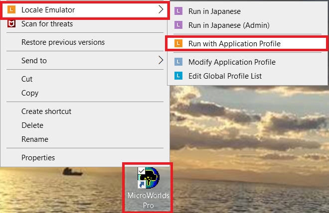
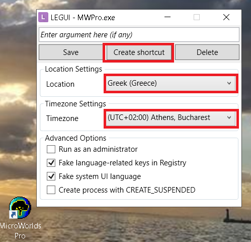

# MICROWORLDS PRO Πρόβλημα εγκατάστασης στα Microsoft Windows 10

## Πρόλογος
Αυτές τις μέρες εμείς του εξωτερικού όπως και όλοι οι άλλοι συμπατριώτες μας λίγο πολύ καθόμαστε στο σπίτι μας στην Ελλάδα.  Είχα την ευκαιρία να ρωτήσω την κόρη μου που είναι μαθήτρια της Γ Γυμνασίου σε Δημόσιο Σχολείο για το μάθημα της πληροφορικής.
Η Δανάη λοιπόν διδάσκεται πληροφορική μέσα από ένα περιβάλλον προγραμματισμού το MICROWORLDS PRO που στηρίζεται στη   
[γλώσσα προγραμματισμού Logo](https://en.wikipedia.org/wiki/Logo_(programming_language)

Ας ξεκινήσουμε από το γεγονός οτι η γλώσσα Logo σχεδιάστηκε και αναπτύχθηκε από το 1967 και φυσικά δε θυμίζει σε τίποτα τις σημερινές γλώσσες προγραμματισμού. 

Ας περάσουμε στο γεγονός οτι το περιβάλλον προγραμματισμού στο οποίο εισάγεται ο μαθητής είναι άθλιο χωρίς καν σοβαρό συντάκτη (editor) χωρίς πρακτικό περιβάλλον εκσφαλμάτωσης (debugger) χωρίς τίποτα που να θυμίζει ένα σύγχρονο περιβάλλον ανάπτυξης μιας συγχρονης τεχνολογίας.

Ξέρω, οι φωστήρες του Υπ. Παιδέιας θα μου πούνε για τις χιλιάδες αναφορές και μελέτες στη διδακτική της πληροφορικής που σχεδόν όλες από το 1980 αναφέρονται στο holly grail τη γλώσσα Dr. Logo. Αλλά αυτά μέχρι το 1990.... Μετά αλλάξαν λίγο τα πράγματα και στις σοβαρές χώρες το εκπαιδευτικό σύστημα χρησιμοποιεί άλλες τεχνολογίες εκμάθησης πληροφορικής που καμία σχέση δεν έχουν με συστύματα του τύπου _της γιαγιάς μου τον καιρό_ που προτείνετε. 

Ναι Κυρίες και Κυριοι του Υπ. Παιδέιας που δεν έχετε γράψει ουτε μια γραμμη επαγγελματικου κώδικα στη ζωή σας, έχουμε 2020, τα σύγχρονα πακετα ανάπτυξης είναι τόσο σύνθετα που κάποιος θα πρέπει να τα στήσει διαφορετικά ανάλογα με το έργο στο οποίο καλείται να κάνει ανάπτυξη, και τέλος έχουν εφευρεθεί και άλλες τεχνολογίες εκτός από την procedural όπως ο αντικειμενοστραφής προγραμματισμός και άλλα τέτοια. Επίσης όλη η γλώσσα ανάπτυξης που προτείνετε είναι βασισμένη στα Ελληνικά με ένα συντακτικό αστείο που δε θυμίζει τιποτα σε αυτό που χρησιμοποιουν οι σημερινες γλώσσες Ο.Ο όπως Java, Python, C#... Μου θυμίζετε εκείνους τους αντίστοιχους φωστήρες που στα χρονια μας στα μαθηματικά της Γ λυκείου θέλανε να γράφουν το ημίτονο _ημ_ , το λογαριθμο  _λογ_ και όχι  _sin_ ή _log_ όπως στην παγκόσμια βιβλιογραφία. Αποτέλεσμα, στο πρώτο έτος στο Μαθηματικό να χρειαστεί να περάσει ένα εξαμηνο μέχρι να συνηθίσουν τα ματάκια μας στην αλλαγή συμβόλων. 

Τέλος, δε ξερω εαν το ξέρετε εκεί στο υπουργείο έχουν βγει και τα Microsoft Windows 10 !!!! You know....

Πάμε τώρα στο φοβερο [MICROWORLDS PRO - το επίσημο εποπτικό μέσο](http://photodentro.edu.gr/edusoft/r/8531/157) που προτείνει το Υπ. Παιδέιας - δε παίζει πάντα στα Microsoft Windows 10. Γιατί? Γιατί απλά η εφαρμογή που προτείνει το Υπ. Παιδείας είναι αρχαία βασισμένη σε 32 bit βιβλιοθήκες, χρησιμοποιεί άλλο code page από τις περισσότερες σύγχρονες εγκαταστάσεις των Microsoft Windows 10 και φυσικά κατά την εγκατάσταση στην οθόνη βγαίνουν μπαρμπουτσαλα στην καθομιλουμένη και _"ακατάληπτα σύμβολα στην ελληνική γραμματοσειρά του microworlds pro" [όπως το έθεσε η γραφουσσα εδω](https://answers.microsoft.com/el-gr/windows/forum/all/%CE%B1%CE%BA%CE%B1%CF%84%CE%AC%CE%BB%CE%B7%CF%80/9529d990-486e-400b-b314-ed8f5e6b0a5f)_

 
 
Το Υπ. Παιδέιας φυσικά δεν μπορεί να λύσει το θέμα στη σελίδα http://photodentro.edu.gr
 
 
Η καθηγήτρια πληροφορικής και οι άλλοι Κύριοι καθηγητές της κόρης μου προφανώς και δεν ήξερε να το λύσει.
 
 
Η Rainbow A.E. που εφτιαξε το πρόγραμμα, φυσικά δεν έχει ανεβάσει κάποια λύση για το θέμα. Βασικά, ούτε site δε βρήκα από αυτούς...
 
 
Η Microsoft Hellas όταν ρωτήθηκε.... πέταξε το μπάλακι αλλου (σ.σ στη Rainbow A.E. )  αφού δικαίως τους τα έψαλλε [οπως φαίνετε εδώ](https://answers.microsoft.com/el-gr/windows/forum/all/%CE%B1%CE%BA%CE%B1%CF%84%CE%AC%CE%BB%CE%B7%CF%80/9529d990-486e-400b-b314-ed8f5e6b0a5f)
Σαν να έλεγε, να αγοράζε το δημόσιο το δικό μας αντιστοιχο προϊόν. Λίγη βοήθεια Κυριοι της Microsoft δε θα έκανε κακό. Τόσα λεφτά πήρατε όλα αυτά τα χρόνια από το Ελλ. Δημόσιο. 
 
Έτσι όπως συνήθως γίνεται στην Ελλαδα, την πληρώνουν οι μαθητες.... και οι γονείς τους φυσικά.

## Πάμε να βρούμε μια λύση

*Η [Illumine IT Consulting](http://illumineit.com) όμως νοιάστηκε και δινει μία λύση*. 
Ακολουθηστε τα παρακάτω βήματα
 

1.  Κατεβάστε το εργαλείο Locale-Emulator για Windows 10 από τη διευθυνση
https://github.com/xupefei/Locale-Emulator/releases/download/v2.4.1.0/Locale.Emulator.2.4.1.0.zip

2.  Καντε το εργαλείο Locale-Emulator  unzip σε ένα directory

3. Μεταβείτε στον κατάλογο που κάνατε unzip και τρεξτε το πρόγραμμα LEIInstaller.exe
Επιλέξτε Install for all Users όπως παρακάτω

4.  Κατεβαστε το προγραμμα MicroWorlds Pro από τη διευθυνση http://photodentro.edu.gr/edusoft/r/8531/157  
και κάντε την unzip σε ένα φάκελο, πχ στον C:\MicroWorlds Pro_GR_From_CD οπως δείχνει η εικόνα

5. **Τωρα προσοχή:**
Πηγαίνετε στο φάκελο που κάνατε  unzip το MicroWorlds Pro  και βρείτε το αρχείο SETUP.EXE
καντε δεξί κλίκ πάνω του και από τις επιλογές διαλέξτε Locale Emulator →  Run with Application Profile.

Από το μενού που εμφανίζεται διαλέξτε τις εξής επιλογές και πατήστε Save

Και περιμένετε να τελειώσει η εγκατάσταση του MicroWorlds Pro. Λ
ογικά, μόλις τελειώσει θα σας δημιουργήσει ένα εικονίδιο.

6. **Πάμε να δουμε πώς το τρέχουμε το ρημάδι...**

Πατήστε πάνω στο εικονίδιο του MicroWorlds Pro καντε δεξί κλίκ πάνω του και από τις 
επιλογές διαλέξτε Locale Emulator →  Run with Application Profile.

Και επιλέξτε τα εξής  στο  μενού που ανοίγει, και τέλος πατήστε Create Shortcut

Θα δημιουργηθεί το ίδιο εικονίδιο, αλλά θα καλεί το  MicroWorlds Pro με το πρόγραμμα του Locale-Emulator.

Αντε και καλό happy coding στους φουκαράδες τους μαθητές Γυμνασίου και Λυκείου και καλά μυαλά στους Φωστήρες του υπ. Παιδείας.

... Τι happy coding να μου πεις... με τέτοια παπαριά, οι φουκαράδες οι μαθητές θα λάβουν τελείως αρνητική εντύπωση για το επάγγελμα του Αναλυτή Προγραμματιστή. Είχαν στο μυαλό τους Minecraft και τους δειξατε σκουπίδια... Τα καταφέρατε για άλλη μια φορά.
