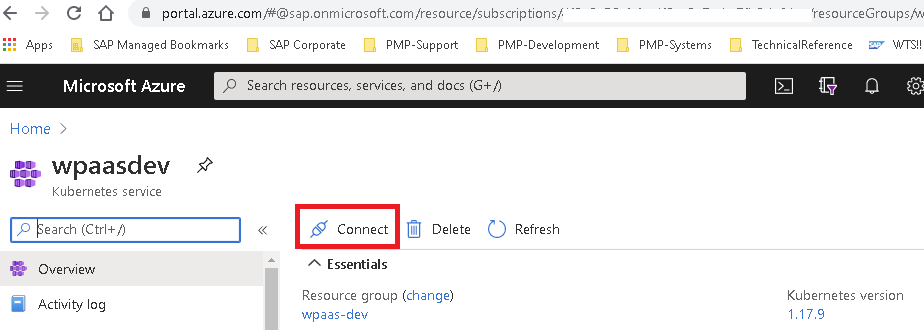

# MS Azure AKS Basics


### Connect to your AKS Cluster
**Exercise:** Your AKS cluster requires MFA Authentication with MS Azure Active 
directory and you have to use a specific VPN to login to the cluster. 

How do you connect?


1. If you connect using VPN: Get connected with F5 BIG IP or your preference VPN client 
to create and maintain your VPN connection.


2. Go to URL https://portal.azure.com/ and do the Microsoft phone verification - 
[MFA](https://en.wikipedia.org/wiki/Multi-factor_authentication) MS procedure


3. In MS portal home, go to _All resources_ and find the AKS cluster you need to connect and select 
the _connect_ icon, then click on it.



4. Steps from this point assume that you have the [MS az](https://docs.microsoft.com/en-us/cli/azure/reference-index?view=azure-cli-latest) commands installed.
You can check this by issuing the comman ```az```

like this:
```bash
C:\>az --version
azure-cli                         2.12.0

core                              2.12.0
telemetry                          1.0.6
```


Open your MS-Dos shell and type the following command
```bash
C:\>az login
To sign in, use a web browser to open the page https://microsoft.com/devicelogin and enter the code XXXXXXXXX to authenticate.
[
  {
    "cloudName": "AzureCloud",
    "id": "0ea89fa8-210b-xxxx-xxxx-xxxxxxxx",
    "isDefault": false,
```
Do as instructions suggest.

5. From the Connect window in MS Azure portal copy the first connection command:
In the same MS-DOS window type the following command
```bash
C:\>az account set --subscription <your subscription id>

C:\>az aks get-credentials --resource-group <the resource group your cluster begins> --name <the AKS cluster name>  --overwrite-existing
```


putting the flag ` --overwrite-existing`  might help you to get rid of error
```
error: error loading config file "C:\Users\c5179796/.kube/config": error converting *[]NamedAuthInfo into *map[string]*api.AuthInfo: duplicate name "clusterUser_someclustername" in list: [{clusterUser_somecluster { [....
```
This error is discussed here: https://github.com/kubernetes/kubernetes/issues/66435


6. Try out some commands
```bash
C:\>kubectl get nodes
To sign in, use a web browser to open the page https://microsoft.com/devicelogin and enter the code XXXXXXXXX to authenticate.
NAME                               STATUS   ROLES   AGE   VERSION
aks-wpaasdev-19766648-vmss000000   Ready    agent   35d   v1.17.9
aks-wpaasdev-19766648-vmss000001   Ready    agent   35d   v1.17.9
aks-wpaasdev-19766648-vmss000002   Ready    agent   35d   v1.17.9
```

Authenticate again, this time to the AKS Cluster Azure AD again by opening the browser to the suggeted URL
https://microsoft.com/devicelogin by entering the proposed code. 

Tryout some commands from the basic Kubernetes cheat sheet:
https://kubernetes.io/docs/reference/kubectl/cheatsheet/