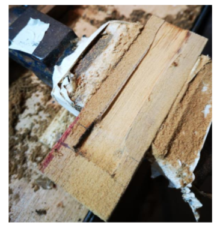

Μιχάλης Μουντράκης – Κατασκευή Ξύλινου Ψαροντούφεκου 22

# Κατασκευή Ξύλινου Λαστιχοβόλου Ψαροντούφεκου 105cm

_Μιχάλης Μουντράκης,_ [_mike __.__ mountrakis __@__ gmail __.__ com_](mailto:mike.mountrakis@gmail.com)

_Αθήνα, Σεπτέμβρης 2020_

Ένα χοντρό Λαβράκι πιασμένο με ξύλινο όπλο κάπου στην Αττική

## Περιεχόμενα

[Περιεχόμενα 2](#_Toc56427657)

[Εισαγωγή 3](#_Toc56427658)

[Προδιαγραφές 4](#_Toc56427659)

[Πίνακας Υλικών 4](#_Toc56427660)

[Εργαλεία 4](#_Toc56427661)

[Αναλώσιμα 5](#_Toc56427662)

[Μέτρα Ασφαλείας 5](#_Toc56427663)

[Χρήσιμες Συμβουλές 6](#_Toc56427664)

[Πώς Χρησιμοποιούμε την Εποξειδική 6](#_Toc56427665)

[Σώμα 8](#_Toc56427666)

[Ο οδηγός του Όπλου μας 11](#_Toc56427667)

[Μορφοποίηση του Όπλου 12](#_Toc56427668)

[Σύνδεση της Λαβής 14](#_Toc56427669)

[Κεφαλή του όπλου 22](#_Toc56427670)

[Πτερύγια Σταθεροποίησης – Stabilizers 23](#_Toc56427671)

[Ανοξείδωτα 25](#_Toc56427672)

[Βαρίδωμα - Ζύγισμα 25](#_Toc56427673)

[Λείανση/Τρίψιμο. 26](#_Toc56427674)

[Καθαριότητα Εργαστηρίου 27](#_Toc56427675)

[Φινίρισμα με teak oil 28](#_Toc56427676)

[Τελικό αποτέλεσμα 28](#_Toc56427677)

[Βιβλιογραφία 29](#_Toc56427678)

## Εισαγωγή

Το καλοκαίρι που μας πέρασε (το Ιούλιο του 2020) στο νησί γνώρισα ένα παιδί 16 χρονών που πραγματικά κένταγε στο άθλημα. Από μικρός μεγαλωμένος δίπλα στη θάλασσα και οντάς σε μια ηλικία που οι επιδώσεις όλο και ανεβαίνουν και ανταγωνίζονται τον ενθουσιασμό του, δε μου έμεινε άλλο από το να χαίρομαι να τον βλέπω να βουτάει και να του πω μερικά πράγματα, τόσο για το ίδιο το ψάρεμα όσο και τα θέματα ασφάλειας που διέπουν το ψάρεμα. Είδα πως κοιτούσε το ξύλινο μου και λίγο πριν φύγω και αφού συνεννοήθηκα με τον πατέρα του εάν θα επέτρεπε κάτι τέτοιο, του το χάρισα με τον απλό όρο να μου υποσχεθεί ότι δε θα βουτάει κάτω από τα 10μ μέχρι να γίνει 18 και ποτέ μόνος του. Ο μικρός το χάρηκε πολύ. Έτσι η 95ρα διλάστιχη οπλάρα με την οποία ψάρευα τα τελευταία δέκα χρόνια πέρασε σε ένα παίχτη με μεγάλες προοπτικές που σίγουρα τη χαίρεται στα ψαρέματα του.

Βεβαίως μπορεί να έχω 12 άλλα όπλα, αλλά ψάρευα σχεδόν αποκλειστικά με δύο, το 85ρι carbon 6.25/130 με λάστιχο φ19 και το ξύλινο 95ρι 2χ φ16, 6.5/130 που χάρισα και φυσικά..... δε μπορώ να μείνω χωρίς οπλάρα χειροποίητη.... Έτσι Ἀνεῤῥίφθω ο κύβος (ο κύβος ερρίφθη) και με την πρώτη ευκαιρία που γύρισα στην πατρίδα μπήκα στο εργαστήριο των 2.5 τμ που φιλοξενεί το οπλοστάσιο και τις κατασκευές.

Επειδή έχω κολλήσει από το 2000 με τη λαβή του θρυλικού DEMKA ΑΜΙ ΙΙ και πραγματικά δυσκολεύομαι να πιάσω άλλο όπλο έτσι εύκολα χωρίς να ρισκάρω βολές _ΣΓΤΚ - Στο Γάμο του Καραγκιόζη_

 είπα ότι το όπλο που θα φτιάξω να έχει αυτή τη λαβή. Το πρώτο πρόβλημα – Που τη βρίσκουμε, βλέπεις ή ιστορική DEMKA έχει κλίσει εδώ και αρκετά χρόνια.... Έψαξα με προβολέα, φακό, κερί αλλά τη βρήκα ... με το λυχνάρι όταν περνώντας από τον DeepCarbon για κάτι αναλώσιμα, είδα μια λαβή ΑΜΙ ΙΙ και ο φίλος είπε ότι είναι για πούλημα. Αγοράστηκε αμέσως και έτσι λοιπόν άρχισα την κατασκευή του όπλου.

Τέλος, είπα να ξαναγράψω όλη την εργασία. Τελευταία φορά το είχα κάνει το 2003 σε ένα μικρό PDF με τίτλο «_Κατασκευή Λαστιχοβόλου Όπλου»_ που είχε κυκλοφορήσει αρκετά χρόνια από το greekdivers.com και μετά από χρόνια μπορώ να πω ότι χρειάζεται συμπλήρωση και ανανέωση μια και από τότε έπαθα και έμαθα…..

Η δουλειά αυτή αφιερώνεται στον Ιατρό Κώστα Μουντράκη που όσο ζούσε ήταν ένθερμος υποστηριχτής μου στο θέμα του Ψαροντούφεκου και ο πρώτος μου δάσκαλος στη θάλασσα . Θείε μου, σ ευχαριστώ για όλα, και όπως είχες πει και εσύ _κρίμα που δε ψαρέψαμε μαζί όσο θα ήθελα..._

Ευχαριστώ πολύ…

- Τη διαχειριστική ομάδα του spearfishingforum.gr και ειδικά τον Πάνο Εξαρχίδη – PanEx για όλη την προσπάθεια από το 2007 με το [https://www.spearfishingforum.gr/](https://www.spearfishingforum.gr/) και γενικότερα, την τεράστια συμβολή του στο χώρο, αλλά και τις κατ&#39; ιδίαν συζητήσεις που κάναμε όλα αυτά τα χρόνια.
- Τον Μανώλη Καραμολέγκο που άοκνα παρείχε βοήθεια και συμβουλές σε όλα τα στάδια της κατασκευής.

## Προδιαγραφές

Σώμα – ελαφρύ όπλο από ξύλο καλής ποιότητας με χαμηλό προφίλ το πολύ 3 εκ.

Λαβή – ΑΜΙ ΙΙ με μηχανισμό της MaiandrosDL για λαβές DEMKA, [https://www.diveshop.gr/index.php/product2984-5790.html](https://www.diveshop.gr/index.php/product2984-5790.html)

Κεφαλή – ανοιχτή που φορτώνει μέχρι και 2 χοντρά λάστιχα

Αρματωσιά

2χ φ16 , 6.5/130 μονόφτερη, πετονιά και δικανάκια 1.4mm

1χ φ17.5, 6.25/130 μονόφτερη, πετονιά και δικανακια 1.6mm

Μουλινέ DYI οριζόντιο από Lexan ικανό για 50m 1.8mm σχοινί

## Πίνακας Υλικών

| **Υλικό** | **Τμχ** | **Διαστάσεις** | ** Ενδεικτική τιμή - Παρατηρήσεις** |
| --- | --- | --- | --- |
| Μονομπλοκ Τεακ Μπουρμα | 1 | 95 x 4 x 3.5 cm.Κομμένο απλανάριστο αλλά ξεφαρδιασμένο | Δώρο του Μαστρο-Νίκου Καραμολέγκου |
| Λαβή | 1 | Λαβή ΑΜΙ ΙΙ | Μεταχειρισμένη 20Ε |
| Οδηγός σχοινιού | 1 | Ιδιοκατασκευή | Inox 316LΜπουλόνι Μ2 χ8με κατάλληλη διαμόρφωση |
| Σωλήνας αλουμινίου 12cm | 1 | Από το παλιό ΑΜΙ ΙΙ 110 | Παλιό εξάρτημα |
| Οδηγός πετονιάς πάνω από τη βέργα | 1 | Ιδιοκατασκευή | Inox 316LΜπουλόνι Μ2 χ8με κατάλληλη διαμόρφωση |

## Εργαλεία

Κορδέλα, πλάνη από Εργαστήριο Καραμολέγκος Μανώλης στο Χαλάνδρι, Μεταμορφώσεως 40

- Black n Decker Router 1200 Watt με κοπτικά 8χιλ, 11 χιλ
- Dremel 3000
- Δράπανο βάσης Black n Decker 600 Watt
- Δράπανο χειρός Bosch 400 Watt
- Τριβείοπαλμικό Black n Decker 600 Watt
- Ράσπες, Λίμες, Τανάλιες, Σιδεροπρίονα, ... Σχεδόν ό,τι είχα το χρησιμοποίησα

## Αναλώσιμα

- Γυαλόπανα ξύλου από 250 μέχρι 80
- Γυαλόπανα σιδήρου από 200 μέχρι 1000
- Εποξειδική και σκληρυντής
- Κόλα πολυουρεθάνης PU MAX Bison
- Κυανοακρυλική Sikaflex marine
- Χαρτοταινίες, ξυράφια,
- Teak Oil
- Διάφορες ανοξείδωτες βίδες Μ2, Μ3, Μ6, σύρματα
- Σχοινάκια, Λατέξ γάντια, Χαρτιά Κουζίνας.

**Αξίζει?**

Θα το δούμε, αλλά μέχρι στιγμής χάρηκα πολύ την κατασκευή.

Γενικά… Εάν έχετε τα περισσότερα εργαλεία και πιάνουν τα χέρια σας, τότε κάντε το. Αλλιώς προτιμήστε ένα ξύλινο από τους φοβερούς Έλληνες κατασκευαστές που πραγματικά φτιάχνουν ασύγκριτα όπλα τα οποία παράλληλα είναι έργα τέχνης.

## Μέτρα Ασφαλείας

**ΠΑΝΤΑ** ….

1. Άπλετο φως παντού στο εργαστήριο, προτιμότερο φωτιστικό μέσο το ιερό άσπρο – crestwhiteLED από σωλήνες φωτισμού. Ειδικά εάν έχετε περάσει τα 40 θεωρώ ότι δεν πρέπει να ξεκινήσετε καμία κατασκευή χωρίς τον άριστο φωτισμό.
2. Ανοιχτές πόρτες και παράθυρα παντού. Είναι προτιμότερο να ενοχλείτε και να κρυώνετε παρά να πεθάνετε από τις αναθυμιάσεις της εποξειδικής, κυανοακρυλικής, πολυουρεθανικής, acetone, teakoil, drilloil, carbonparticles και ότι άλλο θα χρειαστούμε.
3. Γυαλιά, μάσκα μύτης και γάντια πολυαμυδίου σε κάθε κοπή ή τρύπα. **Θυμηθείτε – χωρίς πόδι ή χέρι μπορούμε να ζήσουμε τις οικογένειες μας ενώ χωρίς μάτια ΟΧΙ...**
4. Γάντια λατέξ σε κάθε κόλληση με εποξειδική, κυανοακρυλική, πολυουρεθανική.
5. Όταν αλλάζουμε κεφαλή σε Dremel, Router, δράπανο, ηλεκτρικό κατσαβίδι, η συσκευή να βγαίνει από τη **πρίζα** παρακαλώ…
6. Δε κάνουμε καμία κοπή, τρύπα εάν πρώτα δεν έχουμε εξασφαλίσει ότι το εργαλείο είναι σωστά τοποθετημένο, σε πλήρη ισορροπία και το κοπτικό είναι πολύ καλά ασφαλισμένο πάνω του.
7. Δε κάνουμε καμία κοπή, τρύπα εάν πρώτα δεν έχουμε εξασφαλίσει ότι αυτό που θα κόψουμε ή θα τρυπήσουμε είναι σωστά τοποθετημένο, σε πλήρη ισορροπία και ασφαλισμένο να μη ξεφύγει από τη θέση του από τους κραδασμούς.

## Γενικές Χρήσιμες Συμβουλές

Αυτές καλό είναι να εφαρμόζονται καθ&#39; όλη τη διάρκεια της κατασκευής.

1. Όταν βγάζουμε διάφορα εργαλεία στον πάγκο, τα τοποθετούμε σε ένα σημείο κάθε φορά για να μη τα ψάχνουμε στο σωρό αντικειμένων που έχει ο πάγκος, κάτω από στρώματα από πριονίδι. Η πιο σωστή μέθοδος είναι να συνηθίσετε να έχετε τα εργαλεία σε στάνταρ θέσεις. Το ίδιο συμβαίνει όταν λύνουμε ένα μηχανισμό – τοποθετούμε ΟΛΑ τα εξαρτήματα του σε ένα ή περισσότερα δοχεία κοντά-κοντά για να μη χαθούν.

2. Για να μη πληγωθούν τα ξύλα στη μέγγενη όταν θέλουμε ισχυρή στήριξη αυτών, περνάμε στα σαγόνια της μέγγενης πολλές στρώσεις από μονωτική ταινία καλωδίων η οποία προστατεύει το ξύλο. Έτσι, η μέγγενή σφίγγει χωρίς να τραυματίζει και χωρίς να αφήνει έντονα σημάδια καταπόνησης του ξύλου.

3. Όποτε εφαρμόζουμε σφικτήρες ποτέ δεν αφήνουμε τα σαγόνια του σφικτήρα να έρχονται σε επαφή με το ξύλο. Απλά ποτέ! Πρώτα βάζουμε 5 στρώσεις χαρτοταινία και πάνω από αυτή τα νταβίδια – σφικτήρες.

## Πώς Χρησιμοποιούμε την Εποξειδική – Πως κάνουμε κολλήσεις

Το μίγμα Εποξειδική και Σκληρυντή είναι πολύ ευαίσθητο στις αναλογίες που προτείνει ο κατασκευαστής του. Στην περίπτωση που δεν εφαρμόζετε σωστά τις προδιαγραφόμενες αναλογίες ρητίνης / σκληρυντή, το μείγμα όταν σκληρύνει δεν θα έχει τις αναμενόμενες ιδιότητες και φυσικά δεν πρόκειται να σκληρύνει στο χρόνο που λέει ο κατασκευαστής. Αντιθέτως, εάν το μείγμα έχει λιγότερη ποσότητα από την ποσότητα σκληρυντή που προδιαγράφεται, το μείγμα θα σκληρύνει πολύ αργότερα και αντίστροφα. Τέλος το μίγμα έχει πάντα συγκεκριμένο χρόνο στον οποίο πρέπει να εφαρμοστεί στα αντικείμενα προς κόλληση. Για το λόγο αυτό, πρέπει να μάθουμε να δουλεύουμε με πολύ συγκεκριμένο τρόπο και όχι να αυτοσχεδιάζουμε κάθε φορά. Τα λάθη πληρώνονται…..

Πάμε να δούμε μια μέθοδό για την κατεργασία του μίγματος εποξειδικής / σκληρυντή.

- Πρώτα από όλα. Εφαρμόζουμε τα μέτρα ασφαλείας για την εποξειδική.
- Ξεκαθαρίζουμε τις μονάδες στην οποία αναφέρεται η αναλογία μίγματος. Εάν είναι όγκος, δηλαδή ml χρησιμοποιούμε σύριγγες. Εάν είναι βάρος, δηλαδή gr τότε χρησιμοποιούμε αποκλειστικά ζυγαριά ακριβείας.
- Χρησιμοποιούμε πάντα 2-3 κλάσεις ποσοτήτων που ξέρουμε ότι είναι σωστά μετρημένες και ας χρειαστεί να πετάξουμε την περίσσεια μίγματος ή αν χρειαστεί να φτιάξουμε μία δεύτερη ποσότητα για να συμπληρώσουμε. Έτσι έχουμε μεθόδους για να μετράμε 1ml, 5ml, 10ml ή 5gr, 10gr εάν η αναλογία δίνεται με τα βάρη των στοιχείων.

**Αναλογία μίγματος με όγκο**

- Χρησιμοποιούμε δύο βασικές σύριγγες βαθμολογημένες. Η μία θα χρησιμοποιείται αποκλειστικά για το σκληρυντή και η άλλη αποκλειστικά για την εποξειδική.
- Έχουμε από πριν βαθμολογήσει με κόκκινο/πράσινο μαρκαδόρο σε κάθε σύριγγα τις ποσότητες που χρησιμοποιούμε σε σχέση με την αναλογία. Πχ για αναλογία μείγματος 100/40 σε σύριγγες των 10ml έχω βάλει τις αντίστοιχες γραμμές για να μη ψάχνω εκείνη την ώρα.

**Αναλογία μίγματος με βάρος**

- Χρησιμοποιούμε καπάκια από ποτά ή αλλά μικρά δοχεία από πριν βαθμολογημένα με μαρκαδόρο για το πόσο εποξειδική και σκληρυντή βάζουμε. Μετράμε μία φορά τα βάρη και τα σημειώνουμε στο δοχείο. Πρώτα βάζουμε τον ζυγισμένο σκληρυντή στο δοχείο και σημειώνουμε τη στάθμη του με κόκκινο μαρκαδόρο στο δοχείο. Μετά προσθέτουμε τη ζυγισμένη ρητίνη και σημειώνουμε τη νέα στάθμη του μίγματος με πράσινο μαρκαδόρο στο δοχείο. Με αυτόν τον τρόπο έχουμε ένα δοχείο που μπορεί να χρησιμοποιηθεί σαν μοντέλο για να βαθμολογήσουμε και τα άλλα δοχεία για να μη χρειάζεται να μετράμε κάθε φορά.

**Γενικές Οδηγίες όταν Κολλάμε**

Όταν κολλάμε με εποξειδική ή άλλη ισχυρή κόλλα (πολυουρεθανική/κυανοακρυλική ) προσέχουμε:

- Να έχουμε αποφασίσει από πριν φτιάξουμε το μίγμα πως θα κολλήσουμε τα αντικείμενα.
- Να έχουμε αποφασίσει από πριν φτιάξουμε το μίγμα ποιους σφικτήρες θα χρησιμοποιήσουμε που θα τους βάλουμε και πόσο θα τους σφίξουμε.
- Να έχουμε καθαρίσει το πεδίο που θα γίνει η δουλειά από πριν φτιάξουμε το μίγμα. Σκόνες, πριονίδια και άλλα τέτοια στο χώρο του πεδίου θα αλλοιώσουν το αποτέλεσμα της κόλλησης.
- Αν φτιάχνουμε κάτι δύσκολο, καλό είναι να κάνουμε 1-2 πρόβες από πριν για να δούμε εάν γίνεται η διαδικασία σωστά πριν φτιάξουμε το μίγμα.
- Πάντα σκουπίζουμε την περίσσεια μίγματος όσο αυτή είναι νωπή για να μη τρίβουμε μετά.
- Πάντα αφήνουμε το μίγμα να στεγνώσει ένα 10% περισσότερο χρόνο από ότι λέει ο κατασκευαστής.

## Σώμα

Από ξύλο όπως είπαμε και τι ξύλο…. Απίθανο… Το ξύλο είναι Τηκ Μπουρμα (TeakBurma). Ένα δοκάρι από στραβόξυλο από ένα βυθισμένο καΐκι του 1930 στη Σαντορίνη που έφτασε στα χέρια του Μάστρο Νίκου Καραμολέγκου στο Χαλάνδρι πριν από πολλά χρόνια. Όταν μου έδωσε, έβγαλα από το δοκάρι γύρω στα 5 πηχακια. Είχα δώσει 1-2 στο φιλαράκι μου τον PanEx και 4 κράτησα εγώ. Το ξύλο είναι φανταστικό – δεν έχω δει ποτέ ποιο ισόβενο μαδέρι. Το ίδιο ξύλο χρησιμοποίησα και για το πολύσπαστό μου εδώ:

[https://www.spearfishingforum.gr/viewtopic.php?f=19&amp;t=13567&amp;start=2805](https://www.spearfishingforum.gr/viewtopic.php?f=19&amp;t=13567&amp;start=2805)

Έτσι λοιπόν πήγα στο εργαστήρι του Μανώλη Καραμολέγκου στο Χαλάνδρι που έχει πλέον αναλάβει το εργαστήριο - 2η γενιά επιπλοποιός.

Το προτελευταίο μαδέρι που χρησιμοποίησα κόπηκε κατά μήκος στην κορδέλα, ξεφραδίστηκε και πλανίστηκε μέχρι να γίνει ένα μασίφ και απόλυτα ίσιο μαδέρι με αρχικές διαστάσεις 95 x 4 x 3.5 cm.

95 x4x 3.5 cm.

Στη συνέχεια κόπηκε κατά μήκος με την κορδέλα σε τρία ισόπαχα μέρη, δηλαδή η κάθε ξύλινη φέτα να έχει τελικές διαστάσεις 95χ1.2χ3.5 cm με περίπου 0.2 cm από το αρχικό πάχος της κάθε φέτας που αρχικά ήταν 1.4 cm, να χάνονται στην κάθε κοπή και πλάνισμα.

95 x1.2x 3.5 cm.

Η παρακάτω εικόνα μιλάει μόνη της:

Η μεσαία φέτα ξύλου μπήκε σάντουιτς με τα νερά της ανάποδα από τις άλλες δύο και για να συγκρατηθούν άνοιξα τρύπες για δύο καβίλιες των 6mm στα 15 cm από το άκρο κάθε πλευράς πάντα από Οξυά.

Αγόρασα ανθρακόνημα πλέξης ψαροκόκαλο (Roll) και εποξειδική ρητίνη δύο συστατικών. Έκοψα 12 λωρίδες από το ανθρακόνημα περίπου 95 x 3 cm για να ενισχύσω το σώμα, θα βάλω τις λωρίδες ανθρακονήματος ανάμεσα στις φέτες του ξύλου – από 6 λωρίδες στη σύνδεση της κάθε φέτας.

**Κόλληση του ξύλου με εποξειδική**

Για κάθε μία από τις τρείς φέτες ξύλου:

1. Αγρίεψα την εσωτερική επιφάνεια της φέτας με τη φαλτσέτα σε όλο το μήκος και μετά την τίναξα και τη σκούπισα σχολαστικά. Την καθάρισα και από τις δύο πλευρές με λίγο acetone. Περίμενα να στεγνώσει τελείως το acetone.
2. Πέρασα με το μικρό πινέλο μείγμα εποξειδικής ρητίνης και σκληρυντή και από επάνω έστρωσα το ανθρακόνημα. Σε κάθε κλειστή πλευρά της κάθε φέτας, πέρασα από τρείς λωρίδες ανθρακονήματος με το αντίστοιχο μίγμα εποξειδικής ρητίνης και σκληρυντή – τόσο όσο να μη στάζει το μίγμα. Πρώτα στρώνουμε την κάθε λωρίδα ανθρακονήματος και μετά με το πινελάκι από επάνω εφαρμόζουμε το αντίστοιχο μίγμα εποξειδικής ρητίνης και σκληρυντή.
3. Τοποθέτησα σωστά τις φέτες ξύλου τη μία πάνω στην άλλη ώστε να έρχονται όσο το δυνατόν αλφαδιασμένα στο προφίλ και να μην εξέχει καμία από τις φέτες από κάθε πλευρά.

Τέλος, τοποθέτησα τις 2 καβίλιες των 6mm στα 15 cm από το άκρο κάθε πλευράς στις τρύπες που είχα κάνει, και φυσικά πριν τις τοποθετήσω τις βούτηξα στο μίγμα εποξειδικής ρητίνης και σκληρυντή.

Ασφάλισα με απλές πιάστρες την κατασκευή.

**Πρεσάρισμα**

Σειρά είχε να ασφαλιστεί η κατασκευή του σώματος του όπλου με τα νταβίδια (σφιγκτήρες επιπλοποιίας). Επειδή πρέσα δεν διαθέτουμε ακόμη τουλάχιστον, θα πρέπει να ακολουθηθεί μια σωστή διαδικασία τοποθέτησης των σφιγκτήρων για να μην έχουμε προβλήματα ανισότροπης κατανομής της πίεσης στην επιφάνεια της κατασκευής με αποτέλεσμα το στράβωμα των ξύλων κατά την κόλληση, τη δημιουργία σπηλαίωσης και κενών αέρα στο σώμα του ξύλου καθώς και την εξαγωγή όσων περισσότερων φυσαλίδων αέρα που σίγουρα έχει το μίγμα εποξειδικής ρητίνης και σκληρυντή μετά την ανάδευσή του.

Η μέθοδος πρεσαρίσματος του ξύλου που ακολουθούμε όταν δεν υπάρχει πρέσα που να μπορεί να χωρέσει όλο το εμβαδό της επιφάνειας που πρεσάρουμε είναι _ **η μέθοδος της τέμνουσας** _ και στην εφαρμογή της κατά μήκος της επιφάνειας του ξύλου για τοποθέτηση μίας σειράς σφικτήρων είναι η εξής:

Παίρνουμε δύο ΑΚΑΜΠΤΑ σίδερα πλακέ που χωρούν όλη την επιφάνεια που θέλουμε να πρεσάρουμε. Αυτά θα είναι τα αλφάδια μας – θα κρατούν δηλαδή τα ξύλα που κολλάμε ίσια. Στη δική μου περίπτωση βρήκα δύο σίδερα τύπου γωνίας από αυτά που κάνουμε ράγα για συρόμενες γκαραζόπορτες. Τοποθέτησα αναμεσά στα δύο αυτά σίδερα το σώμα του όπλου με τις επιφάνειες που θέλω να πρεσάρω να εφάπτονται στην επίπεδη σιδερένια επιφάνεια. Τώρα τα σίδερα και το ξύλο ανάμεσά τους είναι ένα σώμα.

1. Στο κέντρο του σώματος τοποθετούμε ένα σφικτήρα με τάση στο 50% της μέγιστης τάσης που πρόκειται να εξασκήσουμε. Ο σφικτήρας εφαρμόζει πάνω στα σίδερα που έχουν στη μέση τους το ξύλο.
2. Σε κάθε μία από τις δύο πλευρές εκατέρωθέν του σφικτήρα βρίσκουμε τα δύο νέα κέντρα και σε αυτά τοποθετούμε από ένα σφικτήρα με τάση στο 50% της μέγιστης τάσης που πρόκειται να εξασκήσουμε.
3. Επαναλαμβάνουμε τα βήματα 1,2 μέχρι να καλύψουμε με σφικτήρες όσο περισσότερο εμβαδόν μπορούμε
4. Τοποθετούμε τους δύο τελευταίους και δυνατότερους σφικτήρες στο κάθε άκρο της κατασκευής. Εφαρμόζουμε πίεση στο 50% της μέγιστης τάσης που πρόκειται να εξασκήσουμε.
5. Σφίγγουμε όλους τους σφιγκτήρες στο 75% της μέγιστης τάσης που πρόκειται να εξασκήσουμε με ακριβώς την ίδια σειρά που τους βάλαμε.
6. Σφίγγουμε ξανά τους σφιγκτήρες στο 100% της μέγιστης τάσης που πρόκειται να εξασκήσουμε με ακριβώς την ίδια σειρά που τους βάλαμε.

Το τελικό αποτέλεσμα φαίνεται στην παρακάτω φωτογραφία:

Άφησα την κατασκευή να στεγνώσει 48 ώρες στη σκιά και σε θερμοκρασία δωματίου, δηλαδή περίπου 25 C.

Όταν βγήκαν οι σφιγκτήρες, το σώμα έπρεπε να πάει στην πλάνη ξανά για τελευταία φορά. Για το λόγο αυτό κούρεψα με το Dremel όλα τα υπολείμματα ανθρακονήματος που έμειναν στο σώμα.

**Πολύ μεγάλη προσοχή με τα σωματίδια του ανθρακονήματος κατά την κοπή και τριβή. Υποχρεωτική χρήση μάσκας σε μύτη και στόμα καθώς και κλειστά γυαλιά εργασίας, ώστε κανένα σωματίδιο από ανθρακόνημα να μην έρχεται σε επαφή με το μάτι. Η εργασία αυτή να γίνεται σε πολύ καλά αεριζόμενο περιβάλλον και όχι σε κλειστό υπόγειο.**

**Τελικές διαστάσεις του σώματος του όπλου μετά το πλάνισμα είναι:**

**Μήκος**  **x**  **Πλάτος**  **x**  **Ύψος = 95**  **x**  **3.6**  **x**  **3**  **cm**

## Ο οδηγός του Όπλου μας

Είναι το λούκι που θα τρέχει η βέργα. Αυτό γίνεται με ένα εργαλείο και μόνο. Το ρούτερ με το κοπτικό των 8mm όπως φαίνεται παρακάτω:

Κάποιος μπορεί να πει ότι η ίδια δουλειά γίνεται και με το Dremel και την ειδική βάση κοπής επιφανειών – προσάρτημα βυθιζόμενης φρέζας όπως παραπάνω. Θεωρώ όμως ότι είναι δυσκολότερο γιατί το Dremel με αυτή τη βάση δεν είναι αρκετά ευσταθές καθώς είναι πολύ ελαφρύτερο από το ρούτερ και μπορεί πολύ εύκολα να γίνει το λάθος και το αυλάκι να κοπεί στραβό ή να ξεφύγει η κοπή και να τραυματίσει ανεπανόρθωτα το σώμα του όπλου.

Τον οδηγό τον έκανα 3.5 mm βαθύ σε όλο το μήκος του όπλου, από άκρη ως άκρη. Πρόσεξα πολύ ώστε ο οδηγός να είναι ανάμεσα στις λωρίδες από το ανθρακόνημα, δηλαδή να φιλοξενείται στην ενδιάμεση φέτα του ξύλου χωρίς να κόβει πουθενά το ανθρακόνημα δεξιά και αριστερά όπως φαίνεται παρακάτω:

Μετά το τέλος, δοκίμασα τη βέργα των 6.5 mm στον οδηγό. Όπως ήταν αναμενόμενο, όπλο/βέργα έχουν προφίλ 30 - 3.5 + 6.5 = 27 mm και νομίζω είναι τόσο χαμηλό όσο πρέπει .

## Μορφοποίηση του Όπλου

Σειρά έχει η μορφοποίηση των πλαϊνών τμημάτων του όπλου. Μέχρι στιγμής το σώμα του όπλου είναι ένα ορθογώνιο παραλληλεπίπεδο αλλά αυτό δε βοηθάει στην υδροδυναμική καθόλου.

Για το λόγο αυτό θα χρειαστούμε ράσπες ξύλου, τριβείο χειρός με γυαλόχαρτα τριβείου 80,100,120,180, το ρούτερ, και τα εξής κοπτικά:

Με το κοπτικό **ν3** κάνουμε τα πλαϊνά του επάνω μέρους, ενώ με το κοπτικό ν2 κάνουμε τα πλαϊνά του κάτω μέρους αρχικά και μετά διαμορφώνουμε τις κάτω έδρες με το τριβείο χειρός και με τα γυαλόχαρτα του τριβείου με νούμερα 80,100,120,180 και αυστηρή σειρά εφαρμογής.

Η προσέγγιση στο προφίλ και το βάθος λείανσης για τη σωστή χρήση του τριβείου γίνεται με το μάτι.

**Προσοχή, στην κεφαλή ΔΕΝ περνάμε κοπή με το ρούτερ** γιατί μας ενδιαφέρει να έχει όσο περισσότερο ξύλο γίνεται και χωρίς ραμποτέ πλαϊνή πατούρα μια και το λάστιχο δεν ακουμπάει εκεί επάνω. Για το λόγο αυτό σταματάμε την κοπή τόσο επάνω όσο και στο κάτω μέρος του σώματος στο εξής σημείο που φαίνεται να έχει σημανθεί με κόκκινο μαρκαδόρο:

Στο σημείο αυτό να πούμε ότι το κάτω μέρος του όπλου κατέβηκε άλλα 0.2 cm εκτός από το σημείο της λαβής και της κεφαλής και το σώμα έχει ύψος 2.8 cm εκτός από μπροστά και πίσω που παραμένει 3 cm.

## Σύνδεση της Λαβής

Στο σημείο αυτό θα πρέπει να πούμε ότι δε γίνεται τρύπα φ26mm σε τόρνο στο σώμα του όπλου για να περάσει η λαβή, όπως το περιγράφει ο Βασίλης Ζωνομέσης σε ένα παλιότερο άρθρο του (νομίζω το 2002) όταν το είχα διαβάσει στο περιοδικό Βυθός. Ο λόγος είναι ότι το σώμα του όπλου είναι πολύ λεπτό, μόλις 30 mm όταν το πάχος της λαβής είναι 26 μm. **Οπότε φτιάχνουμε μόρσο από σωλήνα αλουμινίου για τη λαβή! Η σύνδεση της λαβής με μόρσο τα έχει στάδια κατασκευής όπως παρακάτω:**

**Κατασκευή Μόρσου**

Πρόκειται για την παρακάτω σύνδεση:

Η κατασκευή γίνεται με τα εξής εργαλεία: με τις ράσπες ξύλου, το ξυράφι και με λωρίδες από γυαλόχαρτο μαύρο νούμερα 80, 100, 120.

Πριν γίνει η κατασκευή **μετράμε πολύ προσεκτικά με την παρακάτω μέθοδο** :

1. Κάνουμε μια τελείως κάθετη τομή στο ένα άκρο του ξύλινου σώματος που θα μπει η λαβή. Καθαρίζουμε την τομή με **σφουγγαράκι και acetone**
2. Βάζουμε μια βέργα 8ρα ή 7ρα να κάτσει πάνω στον οδηγό και την πιάνουμε σε 2-3 σημεία με χαρτοταινία για να μη φύγει από τη θέση της.
3. Ασφαλίζουμε τη βέργα στη λαβή του ΑΜΙ ΙΙ. Φέρνουμε τη λαβή του ΑΜΙ ΙΙ πρόσωπο με πρόσωπο με το σώμα του ξύλου. Με έναν ανεξίτηλο μαρκαδόρο ζωγραφίζουμε τον κύκλο που πατάει η λαβή στο ξύλο.
4. Το μόρσο της λαβής μαζί με το ο-ρινγκ έχει 6 cm μήκος και υπολογίζουμε άλλα 4 cm μήκος ξύλινου μόρσου. Τραβάμε τις γραμμές με το μαρκαδόρο κατά μήκος του σώματος σχεδιάζοντας κατά μήκος του σώματος εκεί που θα γίνει το μόρσο.
5. **Έχουμε σωστό το σχέδιο του μόρσου.**

**Εάν το ξύλο δεν πιάνει όλο τον κύκλο, κολλάμε με πολυουρεθανική κόλλα και ένα μικρό πλακάκι από το ίδιο ξύλο στο κάτω μέρος του μόρσου. Ένα τέτοιο ξύλινο πλακάκι πρέπει να έχει πάχος όχι μεγαλύτερο από 2-3**  **mm****. Κόβεται δε με τη σέγα χειρός και με πολύ προσοχή…**

Ακολουθεί η κατασκευή του μόρσου:

1. Κόβουμε ένα παλιό σωλήνα αλουμινίου σε 9 cm μήκος όσο περίπου το μήκος της λαβής που θα μπει στο σωλήνα και άλλα 4 εκ από το ξύλινο μόρσο.
2. Τρώμε με τις ράσπες πάνω, κάτω, δεξιά και αριστερά κατά μήκος του ζωγραφισμένου στο σώμα μόρσου. Δοκιμάζουμε εάν μπαίνει ο σωλήνας – δεν πρέπει να μπαίνει αλλά να είναι στο όριο.
3. Περνούμε κάθετα στο μόρσο και τρίβουμε ώστε να γίνει απόλυτα κυλινδρικό το μόρσο με τις λωρίδες από το γυαλόχαρτο κατά σειρά στα μεγέθη 80, 100, 120.
4. Περνούμε κάθετα στο μόρσο και τρίβουμε ώστε να γίνει απόλυτα λείο το μόρσο με το ξυράφι.

Το τελικό αποτέλεσμα της μέχρι τώρα κατασκευής πρέπει να είναι ως εξής:

**Τοποθέτηση του σωλήνα στο μόρσο.**

1. Αλείφουμε **με μίγμα εποξειδικής με σκληρυντή** το ελεύθερο άκρο του μόρσου του σώματος ΜΟΝΟ στο σημείο τους επαφής με τη λαβή
2. Καθαρίζουμε με _σφουγγαράκι και acetone_την παράπλευρη επιφάνεια του ξύλινου μόρσου και Αλείφουμε την παράπλευρη επιφάνεια του ξύλινου μόρσου με μίγμα εποξειδικής ρητίνης και σκληρυντή.
3. Περνάμε το σωλήνα στο μόρσο, με το δάχτυλο τους σε λατέξ γάντι προσαρμόζουμε την Sikaflex στον πάτο του σωλήνα να εφαρμόζει σωστά και να στεγανοποιεί το ξύλο και αφήνουμε να στεγνώσει η εποξειδική 24 ώρες.

Τελικό αποτέλεσμα

**Ξύλινη Μούφα**

Πολύ μπανάλ το μέχρι στιγμής αποτέλεσμα και φυσικά όλοι θέλουμε να κυνηγάμε με στυλ έτσι;

Οπότε θα φτιάξουμε μια ξύλινη μούφα η οποία θα καλύπτει το γυμνό σωλήνα και θα δίνει την αίσθηση του ενιαίου ξύλου στην οπλάρα μας για να μη λένε ότι γεννηθήκαμε και σε τσαντίρι…

Για το λόγο αυτό χρειαζόμαστε ένα μικρό τμήμα από το ξύλινο μαδέρι από το οποίο ξεκινήσαμε την κατασκευή ή άλλο από το ίδιο ξύλο με όμοια νερά.

Μετράμε και προσαρμόζουμε το ξύλο

1. Φέρνουμε το ξύλο πρόσωπο με το σωλήνα
2. Με το στυλό βρίσκουμε τα πάνω και κάτω άκρα που ο σωλήνας βλέπει το ξύλινο τμήμα.
3. Με το στυλό βρίσκουμε τα δεξιά και αριστερά άκρα που το ξύλινο σώμα του όπλου βλέπει το ξύλινο τμήμα τους μούφας.
4. Σχεδιάζουμε το ορθογώνιο στο οποίο πρέπει να προσαρμοστεί το ξύλινο τμήμα και φέρνουμε τις διαγώνιες του. Εκεί θα είναι το κέντρο τους τρύπας φ28 mm στο ξύλο που επιλέξαμε. Βλέπε παρακάτω σχήμα.

Στη συνέχεια, με το τρυπάνι ξύλου, το γνωστό φτεράκι των 28mm και το τρυπάνι βάσης κάνουμε μια εγκάρσια – κατά μήκος τρύπα φ28 mm στο ξύλο που επιλέξαμε.

**Προσοχή** , πρέπει να στερεώσουμε το ξύλο πολύ καλά γιατί το φτεράκι δημιουργεί έντονους κραδασμούς που αποσταθεροποιούν πολύ το τρυπάνι, με αποτέλεσμα να δημιουργηθεί τζόγος ανάμεσα στη μούφα και στο σωλήνα κάτι που προσπαθούμε να αποφύγουμε τους και να έχει.

Αφού έγινε ή τρύπα σωστά, πάμε να κολλήσουμε τη μούφα στο σώμα του όπλου

1. Αγριεύουμε το εξωτερικό του σωλήνα με το σιδεροβουρτσακι προσαρμοσμένο στο δράπανο και με τη σέγα σιδήρου (η σέγα έχει οδοντοειδές βήμα 12 npi)
2. Καθαρίζουμε το εσωτερικό τους μούφας με _σφουγγαράκι και acetone_
3. **Εφαρμόζουμε**  **Sikaflex marine** μέσα στην τρύπα τους μούφας.
4. Τοποθετούμε σωστά τη μούφα να αγκαλιάζει το σωλήνα και να είναι προφίλ με το σώμα του όπλου.
5. Στερεώνουμε με χαρτοταινίες και τοποθετούμε λίγη Sikaflex εκεί που η μούφα εφαρμόζει με το όπλο.
6. Αφήνουμε 24 ώρες να στεγνώσει.

Μόλις στεγνώσει, προχωράμε με την τελική διαμόρφωση τους μούφας.

Πρώτα με τη ράσπα φτιάχνουμε τον οδηγό, και στη συνέχεια με τη σέγα χειρός κάνουμε μία κοπή κατά μήκος τους στο σχήμα παρακάτω για να αλφαδιάσουμε τη μούφα με το σώμα του όπλου:

**Καπάκι τους μούφας**

Στο σημείο αυτό μπορεί κανείς να πει ότι έχουμε τελειώσει, τους υπάρχει μια μικρή λεπτομέρεια. Η μούφα πιάνει στο σώμα του όπλου αφήνοντας λίγο έξω το σωλήνα που έχει αγκαλιάσει σε ένα σημείο που μπορεί να βάλει νερά και να χαλαρώσει ή να σαπίσει το σώμα στο σημείο εκείνο. Για το λόγο αυτό, θα βάλουμε ένα καπάκι στο κάτω μέρος τους μούφας έτσι ώστε να πιάνει σωστά τη μούφα δίνοντας τους λίγα εκατοστά ακόμη ποιο σταθερής κόλλησης στο σώμα του όπλου. **Ένα τέτοιο ξύλινο πλακάκι πρέπει να έχει πάχος όχι μεγαλύτερο από 2-3**  **mm****. Κόβεται δε με τη σέγα χειρός και με πολύ προσοχή…**

**Για το σκοπό αυτό κόβουμε μια φέτα από το κάτω μέρος τους μούφας σύριζα με το κάτω μέρος του όπλου – όσο ποιο χαμηλά γίνεται τους παρακάτω**

**Στη συνέχεια** χρειαζόμαστε ένα μικρό πλακάκι από το ξύλινο μαδέρι από το οποίο ξεκινήσαμε την κατασκευή ή άλλο από το ίδιο ξύλο με όμοια νερά. Το πλακάκι έχει πάχος τόσο όσο να καλύπτει το σωλήνα εξ ολοκλήρου και να εφαρμόζει στο κάτω μέρος τους σώματος του όπλου πολύ σωστά χωρίς να προεξέχει εκατέρωθεν.

Το επόμενο βήμα είναι να φάμε όσο ξύλο γίνεται με το Dremel και το αντίστοιχα κοπτικά μπίλια και κύλινδρο λείανσης Dremel 192, Dremel 408 για να θαφτεί τελείως ο σωλήνας στο ξύλο τους φαίνεται στην παρακάτω φωτογραφία.

Τέλος, κολλάμε με αρκετό μείγμα εποξειδικής ρητίνης και σκληρυντή το διαμορφωμένο πλακάκι στην επιφάνεια του κάτω μέρους του όπλου τους φαίνεται παρακάτω.

Εφαρμόζουμε σωστά τους σφιγκτήρες και τη μέγγενη και αφήνουμε να στεγνώσει 24 ώρες.

Στο τέλος, κάλυψα με χαρτοταινία το πίσω μέρος του όπλου και έβαλα εκεί που πιάνει ο σωλήνας στη μούφα Sikaflexmarine παντού.

## Κεφαλή του όπλου

Το όπλο θα φιλοξενεί μέχρι δύο λάστιχα. Για το λόγο αυτό θα κάνουμε στην κεφαλή δύο τρύπες με το τρυπάνι βάσης και την αρίδα ξύλου φ19. Στη συνέχεια εφαρμόσαμε σωστή διαμόρφωση στο ξύλο ώστε τα λάστιχα να φωλιάσουν σωστά χωρίς να ακουμπάει το ένα πάνω στο άλλο όσο το δυνατόν με το δράπανο χειρός και το κοπτικό υψηλής ταχύτητας Dremel 114 7.8M.

Επειδή θέλουμε να έχουμε το κεφάλι μας ήσυχο ότι η κεφαλή του όπλου θα αντέχει το φόρτο των ελαστικών, ενισχύσαμε την κατασκευή με δύο ξύλινα πλακάκια πάνω και κάτω από τις τρύπες των ελαστικών. Το πάνω πλακάκι έχει πάχος 5mm, μήκος 8cm και πλάτος 3.6cm όπως και το κάτω. Το κάθε πλακάκι φτιάχτηκε από τα ρετάλια που περίσσεψαν από δεξιά και αριστερά από το ξύλινο μαδέρι από το οποίο ξεκινήσαμε την κατασκευή ή άλλο από το ίδιο ξύλο με όμοια νερά. **Κόπηκαν με τη σέγα χειρός και με πολύ προσοχή. Κολλήθηκαν με μείγμα εποξειδικής και σκληρυντή στην κεφαλή του όπλου με τη χρήση της μέγγενης και 2-3 σφιγκτήρων.**

Στη συνέχεια πάλι με τη ράσπα, διαμορφώνουμε το πάνω πλακάκι ώστε να κοπεί στη μέση εκεί που περνάει ό οδηγός έτσι ώστε να δέχεται τη βέργα σωστά.

Δείτε το αποτέλεσμα κάτω, όταν πλέον το όπλο έχει τελειώσει:

Τέλος με λωρίδες από το γυαλόχαρτο κατά σειρά στα μεγέθη 80, 100, 120 λειάναμε τις τρύπες. Στην παρακάτω φωτογραφία, η κεφαλή κατά τη διάρκεια της λείανσης.

## Πτερύγια Σταθεροποίησης – Stabilizers

Αυτά χρησιμοποιούνται για τους εξής λόγους

- Δίνουν περισσότερο όγκο ξύλου στην περιοχή της λαβής και έτσι ισοφαρίζουν το βάρος της λαβής και του μηχανισμού προσεγγίζοντας την ουδέτερη πλευστότητα που είναι το επιθυμητό αποτέλεσμα ζυγίσματος του όπλου.
- Χρησιμοποιούνται για να στερεώνουνε την πετονιά ώστε να περνάει μόνο από το κάτω μέρος του όπλου.
- Παρέχουν μηχανική υποστήριξη στη μούφα.
- Απορροφούν μέρος της ανάκρουσης κατά τη βολή.

Για να φτιάξουμε τα πτερύγια χρειαζόμαστε ένα παχάκι μήκος x πλάτος x ύψος = 15 x 3 x 1.5 cm το οποίο θα κοπεί από τα ρετάλια που περίσσεψαν από το ξύλινο μαδέρι από το οποίο ξεκινήσαμε την κατασκευή ή άλλο από το ίδιο ξύλο με όμοια νερά. **Κόπηκε με τη σέγα χειρός και με πολύ προσοχή.**

Το πηχάκι κόβεται κατά μήκος σε δύο ίσα μέρη. Τα δύο νέα ξύλινα μέρη που βγήκαν από το πηχάκι κολλήθηκαν με μείγμα εποξειδικής και σκληρυντή έτσι ώστε να πιάνουν το πλαϊνό του σώματος του όπλου και τη μούφα χρήση της μέγγενης και 2-3 σφιγκτήρων.

Εφαρμόζουμε σωστά τους σφιγκτήρες και τη μέγγενη και αφήνουμε να στεγνώσει 24 ώρες.

Αφού στεγνώσει, με τη ράσπα ξύλου και το Dremel 192, Dremel 408 διαμορφώνουμε τα πτερύγια ώστε να πάρουν το τελικό υδροδυναμικό τους σχήμα όπως φαίνεται παρακάτω.

## Ανοξείδωτα

Κατασκεύασα τον κρίκο που περνάει το σχοινί του Μουλινέ καθώς και το άγκιστρο της πετονιάς στην κεφαλή του όπλου από μπουλόνια inox Μ2 / 6mm μήκος όπως φαίνεται στη φωτογραφία. Βεβαίως να πούμε ότι τα πάσα από το μπουλόνι εξομαλύνθηκαν με τις λίμες σιδήρου και λειάνθηκαν με γυαλόχαρτα σιδήρου (μαύρα) μέχρι ν600.

## Βαρίδωμα - Ζύγισμα

Το όπλο αρματώθηκε πρόχειρα και μπήκε στη θάλασσα για να ζυγιστεί μέσα στο νερό με τη βοήθεια από μικρά κομματάκια από μολύβι ζυγοστάθμισης. Επειδή ακριβώς το σώμα του όπλου είναι σχετικά μικρό δε χρειάστηκαν παρά γύρω στα 80gr στο ύψος της κεφαλής του όπλου. Στη συνέχεια, με το ρούτερ και το κοπτικό των 8mm με το οποίο έκανα και τον οδηγό της βέργας, έκανα μια θήκη οβάλ κοντά στην κεφαλή του όπλου.

Τα 80gr μολυβιού λειώθηκαν στο μάτι της κουζίνας σε μπρίκι που χρησιμοποιώ μόνο για αυτή τη δουλειά και χυθήκαν μέσα στην οβάλ θήκη και βγήκαν ακόμη ζεστά για να μη καούν τα ξύλα και οι ρητίνες.

Ετοίμασα μια μικρή δόση μίγματος ρητίνης σκληρυντή και κόλλησα το μολυβένιο βάρος στην οβάλ θήκη. Όπως και στον οδηγό της βέργας, πρόσεξα πολύ ώστε ο η θήκη να είναι ανάμεσα στις λωρίδες από το ανθρακόνημα, δηλαδή να φιλοξενείται στην ενδιάμεση φέτα του ξύλου χωρίς να κόβει πουθενά το ανθρακόνημα δεξιά και αριστερά όπως φαίνεται παρακάτω:

## Λείανση/Τρίψιμο.

Κατ&#39; αρχήν για να μη κάνουμε ζημιά στο σώμα του όπλου κατά τη διάρκεια της κατασκευής υπάρχουν τα εξής κόλπα:

- Για να μη πληγωθούν τα ξύλα στη μέγγενη όταν θέλουμε ισχυρή στήριξη αυτών, περνάμε στα σαγόνια της μέγγενης πολλές στρώσεις από μονωτική ταινία καλωδίων η οποία προστατεύει το ξύλο. Έτσι, η μέγγενή σφίγγει χωρίς να τραυματίζει και χωρίς να αφήνει έντονα σημάδια καταπόνησης του ξύλου.
- Όποτε εφαρμόζουμε σφικτήρες ποτέ δεν αφήνουμε τα σαγόνια του σφικτήρα να έρχονται σε επαφή με το ξύλο. Απλά ποτέ! Πρώτα βάζουμε 5 στρώσεις χαρτοταινία και πάνω από αυτή τα νταβίδια – σφικτήρες.

Έτσι, τελειώνοντας την κατασκευή δεν είχε και πολλά συμμαζέματα. Τα περισσότερα είναι αυτά:

1. Γεμίζουμε τυχών μεγάλα κενά και εμφανή σημάδια, αμυχές και τρύπες με μίγμα εποξειδικής και σκληρυντή και πριονίδι από το ξύλο. Αφήνουμε να στεγνώσει σχολαστικά.
2. Μόλις στεγνώσει, περνάμε ένα τρίψιμο με ψιλή ράσπα σιδήρου, με μικρό δόντι και μετά με γυαλόχαρτο. Ο λόγος που χρησιμοποιούμε ράσπα σιδήρου είναι ότι η ράσπα είναι πολύ σκληρή και μπορεί να δουλέψει σε μικρό εμβαδό πάνω στο σημείο που προσπαθούμε να διορθώσουμε και όχι όπως το γυαλόχαρτο που χρειάζεται χώρο και εξομαλύνει τόσο το σημείο που θέλουμε όσο και τα γειτονικά. Η ίδια δουλειά γίνεται φυσικά πολύ καλύτερα με Dremel και τα κοπτικά 408 ή 431.
3. Ξύνουμε περίσσεια από κόλες με το ξυράφι κάθετα
4. Περνάμε το σώμα του όπλου με το παλμικό τριβείο τα νούμερα από τα κόκκινα γυαλόχαρτα 100, 120, 150, 180 εκεί που μπορεί να τρίψει το τριβείο.
5. Περνάμε με το χέρι και τα αντίστοιχα νούμερα χειρός (καφέ γυαλόχαρτα) για τα μέρη που δε μπορεί να καλυφθούν από το τριβείο. Η φορά τριψίματος να είναι κατά μήκος τους όπλου.
6. Για να τρίψουμε τον οδηγό, παίρνουμε μια αρίδα τρυπανιού 8mm την περνάμε κυλινδρικά τα αντίστοιχα καφέ γυαλόχαρτα χειρός στα νούμερα 120, 150, 180, 200 και με το σχέδιο αυτό τρίβουμε τον οδηγό.

1. Φυσούμε πολύ καλά να φύγουν τα πριονίδια, καθαρίζουμε με στεγνό πινέλο το όπλο
2. Καθαρίζουμε το όπλο με πανάκι με λίγο acetone.

Στο σημείο αυτό καθαρίζουμε το εργαστήριο από σκόνες και πριονίδια

## Καθαριότητα Εργαστηρίου

Με μεγάλη σχολαστικότητα καθαρίζουμε το εργαστήρι πριν περάσουμε λούστρα, τικ όιλ ή βερνίκια. Η μέθοδός που εφαρμόζω είναι η παρακάτω:

1. Ανοίγουμε όλες τις πόρτες και τα παράθυρα διάπλατα. Φοράμε μάσκα μύτης και κλειστά γυαλιά.
2. Με σκουπάκι μαλακής τρίχας ξεσκονίσματος ξεσκονίζουμε τα ράφια και τους τοίχους παντού. Ξεκινούμε πάντα από πάνω προς τα κάτω μέχρι να φτάσουμε στο πάτωμα.
3. Με το χέρι ξεδιαλέγουμε τα χοντρά κομμάτια τικ και τα φυλάμε για μελλοντικές κατασκευές
4. Μαζεύουμε με το σκουπάκι χειρός τα χοντρά και βάζουμε με το φαράσι το πριονίδι σε σακούλα για πέταμα.
5. Αφού καθαρίσουμε τα πάντα όλα με το χέρι πολύ καλά μαζεύουμε όλα τα εργαλεία και χρήσιμα αντικείμενα από τον πάγκο εργασίας και τα βάζουμε στη θέση τους. Κλείνουμε τις εργαλειοθήκες και μαζεύουμε με το χέρι και το σκουπάκι όλο το πριονίδι από τον πάγκο μας.
6. Βάζουμε την ηλεκτρική στη μέγιστη ισχύ και καθαρίζουμε τον πάγκο και το πάτωμα.
7. Αφήνουμε μία μέρα να κάτσει ή σκόνη και την επόμενη πριν ξαναρχίσουμε ξαναπερνάμε την ηλεκτρική στους τοίχους πρώτα και μετά στο πάτωμα.

## Φινίρισμα με teakoil

Χρησιμοποίησα τηκ οιλ της εταιρίας Sika (ref 435676) που κατά τη γνώμη μου είναι το καλύτερο, όμως και το ακριβότερο. Προστατευτικό λάδι υψηλών προδιαγραφών τελείως διαφανές με μεγάλη αντοχή στις UV ακτινοβολίες και στο χρόνο. Βεβαίως 40Ε για 2.5 λίτρα…

Πέρασα 4 χέρια κάθε 24 ώρες αφήνοντάς το όπλο να στεγνώσει σε μόνιμα σκιερό μέρος στο μπαλκόνι.

## Τελικό αποτέλεσμα

Στο όπλο έβαλα ένα ζεύγος περαστά λάστιχα Seagull 16mm και μία βέργα Bluetec 6.5/130 με καρχαριάκια από τις παλιές που τα καρχαριάκια ήταν τελείως πίσω κοντά στο κλειδί της βέργας. Το όπλο με τη βέργα πάνω του έχει προφίλ 20mm, δηλαδή όσο και ένα αλουμινένιο! Τέλος αρμάτωσα τη βέργα με 4 μήκη πετονιάς 1.6mm και κλιπαρισμένα δικανάκια. Ιδού μερικές φωτογραφίες:

## Βιβλιογραφία

1. Μιχάλης Μουντράκης -  [Κατασκευή Λαστιχοβόλου Όπλου 2003](MichaelDolphin.pdf).
2. Βασίλης Ζωνομέσης – Ξύλινα Όπλα, περιοδικό Βυθός 2002
3. [https://www.spearfishingforum.gr/](https://www.spearfishingforum.gr/) Διάφοροι - _Βήματα για την κατασκευή Ξύλινου Όπλου_[https://www.spearfishingforum.gr/viewtopic.php?f=19&amp;t=31635&amp;start=1785&amp;sid=d4c3da2a448d638ae08cf7ea7605b8c7](https://www.spearfishingforum.gr/viewtopic.php?f=19&amp;t=31635&amp;start=1785&amp;sid=d4c3da2a448d638ae08cf7ea7605b8c7)
4. [https://www.spearfishingforum.gr/](https://www.spearfishingforum.gr/) Γιάννης Γιαννέλος _Ιδιοκατασκευή 110 Ξύλινου όπλου_[https://www.spearfishingforum.gr/viewtopic.php?f=19&amp;t=67690](https://www.spearfishingforum.gr/viewtopic.php?f=19&amp;t=67690)

[1](#sdfootnote1anc)_Στο Γάμο Του Καραγκιόζη….._

[i](#sdendnote1anc) NpI: notch per inch

