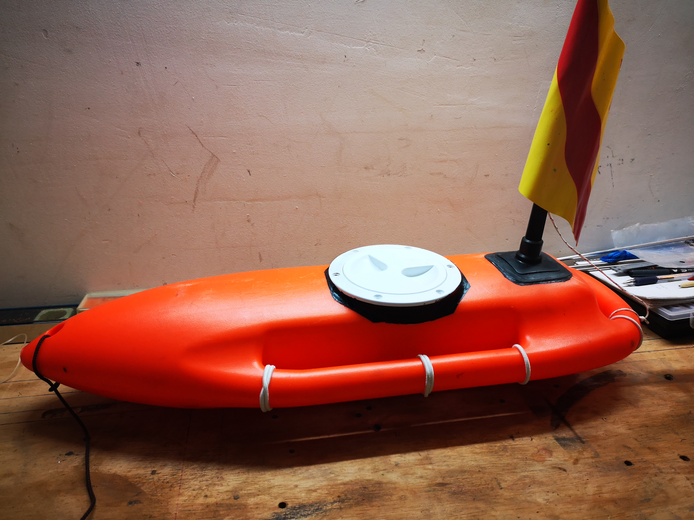
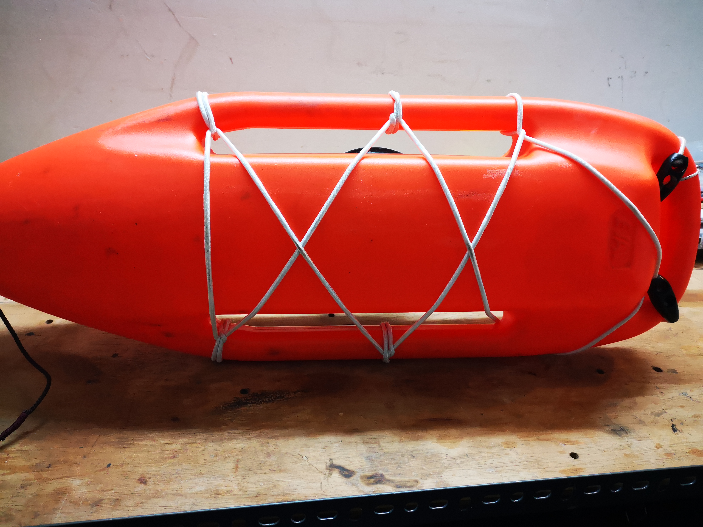
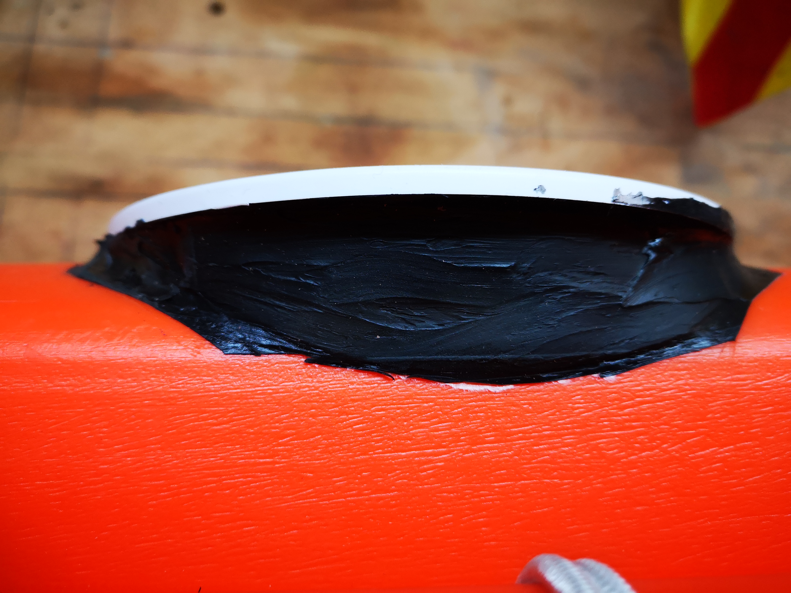

# Σημαδούρα/πλωτήρας Pamela Anderson

Δημοσίευση στο θέμα

[https://www.spearfishingforum.gr/viewtopic.php?f=19&amp;t=54378&amp;p=730806&amp;hilit=%CF%80%CE%B1%CE%BC%CE%B5%CE%BB%CE%B1#p730806](https://www.spearfishingforum.gr/viewtopic.php?f=19&amp;t=54378&amp;p=730806&amp;hilit=%CF%80%CE%B1%CE%BC%CE%B5%CE%BB%CE%B1#p730806)

## Υλικά

**Υλικα / Τεμαχια / Τιμη**

Eval πλωτηρας ΠΑΜΕΛΑ 1 τμχ 16 Ε

Eval ταμπουκι 1 τμχ 5 Ε

Ελαστικο Σχοινι 3 μ 3Ε

Ελιες 2 τμχ 3 Ε

Σικαφλεξ σωληναριο 1 τμχ 6 Ε

Όλα αγοράστηκαν από τον Αναγνωστόπουλο Nik. Plastira 13, Thessaloniki 551 32

Γιατί ήταν ποιο κοντά από εκεί που ήμουν και τα είχε όλα https://marineshop.gr/

Βεβαίως δεν ξέρω εάν είναι ο φθηνότερος....

## Αναλώσιμα

Σημαιάκι απο παλιά σημαδούρα

Σαμπρέλα και κάτι παλιά λουράκια από καταδυτικό μαχαίρι

2 inox βιδες με παξιμάδι

## Εργαλεια

Dremel με κοπτικα κοπης και λειανσης

Μαρκαδορος

## Ωρες

2 στο σύνολο μια και πέρασα δυο φορες σικαφλεξ και διπλή σαμπρελα

** Προσοχή**
ΑΝΑΖΗΤΕΙΤΑΙ ΚΙΤΡΙΝΗ ΜΠΟΓΙΑ ΑΠΟ ΑΥΤΗ ΠΟΥ ΒΑΦΟΥΝ ΤΗ ΣΗΜΑΝΣΗ ΤΩΝ ΔΡΟΜΩΝ

οι ανθρωποι του δημου στο χαλανδρι δε μου δωκανε.............................................................