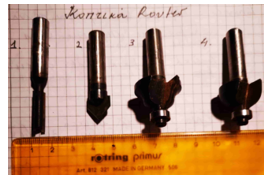
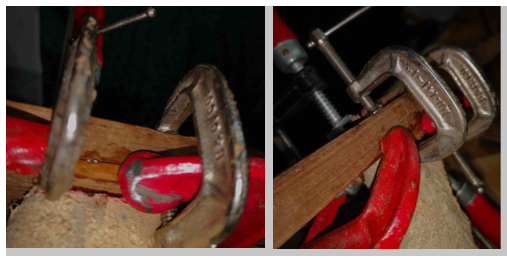
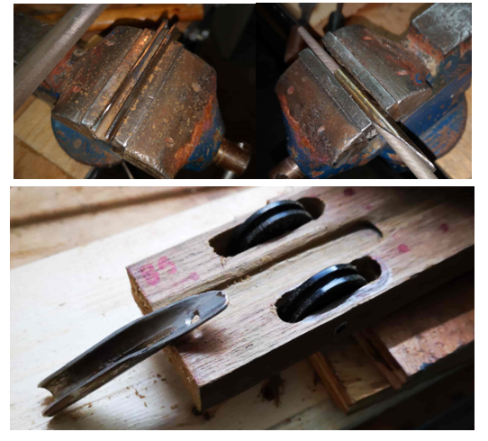

Μιχάλης Μουντράκης – Κατασκευή Ξύλινου Πολύσπαστου Ψαροντούφεκου 16

# Κατασκευή Ξύλινου Πολύσπαστου Ψαροντούφεκου

_Μιχάλης Μουντράκης,_ [_mike __.__ mountrakis __@__ gmail __.__ com_](mailto:mike.mountrakis@gmail.com)

_Αθήνα, Νοέμβρης 2020_

_Το πολύσπαστο στον κηπο_

## Περιεχόμενα

#

[Κατασκευή Ξύλινου Πολύσπαστου Ψαροντούφεκου 1](#_Toc59543969)

[Περιεχόμενα 2](#_Toc59543970)

[Εισαγωγή 3](#_Toc59543971)

[Προδιαγραφές 4](#_Toc59543972)

[Πίνακας Υλικών 4](#_Toc59543973)

[Εργαλεία 6](#_Toc59543974)

[Αναλώσιμα 6](#_Toc59543975)

[Μέτρα Ασφαλείας 6](#_Toc59543976)

[Γενικές Χρήσιμες Συμβουλές 7](#_Toc59543977)

[Πώς Χρησιμοποιούμε την Εποξειδική – Πως κάνουμε κολλήσεις 7](#_Toc59543978)

[Σώμα 10](#_Toc59543979)

[Χειρολαβή 10](#_Toc59543980)

[Ο οδηγός του Όπλου μας 11](#_Toc59543981)

[Μορφοποίηση του Όπλου 12](#_Toc59543982)

[Τοποθέτηση του Μηχανισμού και Σύνδεση της Λαβής 14](#_Toc59543983)

[Κεφαλή του όπλου 15](#_Toc59543984)

[Ανοξείδωτα 17](#_Toc59543985)

[Ντίζα τάνυσης 19](#_Toc59543986)

[Ουρά του όπλου – Όπλιστρο. 19](#_Toc59543987)

[Λείανση/Τρίψιμο. 20](#_Toc59543988)

[Καθαριότητα Εργαστηρίου 21](#_Toc59543989)

[Φινίρισμα με teakoil 21](#_Toc59543990)

[Τελικό αποτέλεσμα 21](#_Toc59543991)

[Βιβλιογραφία 24](#_Toc59543992)

## Εισαγωγή

Το πολύσπαστο Ψαροντούφεκο το γνώρισα αποκλειστικά από το Ίντερνετ. Δεν το ψάρεψα πριν το κατασκευάσω για να λέμε την αλήθεια ούτε το ήξερα από πριν. Έτσι λοιπόν διαβάζοντας [αυτό το post στο spearfishingforum](https://www.spearfishingforum.gr/viewtopic.php?f=19&amp;t=13567&amp;start=2370) και βλέποντας τα κομψοτεχνήματα των υπολοίπων, είπα να κάνω και εγώ την απόπειρα που θα δείτε βήμα-βήμα στις επόμενες σελίδες. Όλη η δουλειά έγινε τα απογεύματα της περιόδου Νοέμβριου – Δεκέμβριου 2020 στο υπόγειο εργαστήριο των 2.5 m2 στην Αθήνα μια και δε μπορούσαμε να ψαρέψουμε.

Για άλλη μια φορά ευχαριστώ πολύ tον Μανώλη Καραμολέγκο, επιπλοποιό, που άοκνα παρείχε βοήθεια και συμβουλές σε όλα τα στάδια της κατασκευής.

## Προδιαγραφές

Σώμα – μετρίως βαρύ όπλο από ξύλο καλής ποιότητας με πολύ χαμηλό προφίλ 1.8 cm. Το μήκος όπλισης να είναι στα 85 cm ενώ όλο το όπλο γύρω στα 115 cm.

Λαβή – Χειροποίητη με σύστημα αυξημένης πρόσφυσης για το γαντοφορεμένο χέρι.

Μηχανισμόςσκανδάλης Trigger Predator Long της MVD

[https://www.mvd-retail.gr/product-page/trigger-predator-long](https://www.mvd-retail.gr/product-page/trigger-predator-long)

**Αρματωσιά**

2 x φ18, 6.5 mm/130 cm μονόφτερη, πετονιά και δικανάκια 1.4mm

Μουλινέ Vertical New Soft Reel της MVD https://www.mvd-retail.gr/product-page/reel-vertical-new-soft

## Πίνακας Υλικών

| **Υλικό** | **Τμχ** | **Διαστάσεις** | **Ενδεικτική τιμή - Παρατηρήσεις** |
| --- | --- | --- | --- |
| Μονομπλοκ Τηκ Μπουρμα | 1 | 150 cm x48 mm x21mmΚομμένο απλανάριστο αλλά ξεφαρδιασμένο | Δώρο του Μάστρο-Νίκου Καραμολέγκου |
| Βαρούλκα              | 2 | Ράουλο για σκάφος Optimist 4 και μικρά dinghy. Διάμετρος σχοινιού: 5mm - Διάμετρος ρουλεμάν: 17mm - Όριο αντοχής 300kg. Από τα MarinaStores, κωδικός 92462https://www.marinastores.gr/product/278-raoyla-kai-axesoyar/3062-mikro-raoulo-mono-me-rouleman-rodela | 2 χ 5.37 = 10.47 Ε |
| Ράουλα | 2 | Invert Roller RAM/G3 wheels της MVD OD 30mm, ID 25mm, thickness 8mmhttps://www.mvd-retail.gr/product-page/invert-roller-g2-wheels-pair | 5.90 Ε |
| Άξονας για Ράουλα | 1 | ο άξονας είναι από Inox σωληνάκι Φ6/Φ8 χωρίς βίδες ή άλλα. |   | 
| Μηχανισμός σκανδάλης με σχοινοπιάστρα επάνω | 1 | Trigger Predator Long της MVD, κωδικός MVD10374[https://www.mvd-retail.gr/product-page/trigger-predator-long](https://www.mvd-retail.gr/product-page/trigger-predator-long)77 mm x 13 mm x 10 mm | Trigger Predator Long 44.5 Ε |
| Υποφυλακτήρας Σκανδάλης | 1 | Ιδιοκατασκευή | Inox 301 | Άγκιστρα ελαστικών | 2 | Ιδιοκατασκευή | Inox 316LΜπουλόνι Μ4 χ4|
| Άγκιστρα ελαστικών - μανιτάρια | 4 | Ιδιοκατασκευή | Inox 316LΜπουλόνι Μ2 χ42 Ροδελες πάνω κατω1 Σωληνάκι Inox Φ4/Φ6 mm από τον Τρεζο trezos-marine.gr |
| Οδηγός σχοινιού | 1 | Ιδιοκατασκευή | Inox 316LΜπουλόνι Μ2 χ8με κατάλληλη διαμόρφωση |
| Οδηγός πετονιάς πάνω από τη βέργα | 1 | Ιδιοκατασκευή | Inox 316LΜπουλόνι Μ2 χ8με κατάλληλη διαμόρφωση |
| Οδηγός πετονιάς στη λαβή | 1 | Ιδιοκατασκευή | Inox 316LΜπουλόνι Μ2 χ8με κατάλληλη διαμόρφωση |
| Οδηγός βέργας στην κεφαλή | 1 | Ιδιοκατασκευή από σωληνάκι Inox 316L Φ8/Φ10mm με κατάλληλη διαμόρφωση |
| Ντίζα | 1 | Dyneema 3 mm | trezos-marine.gr |
| Καμπάνα | 1 | Kevlar full 2 mm | trezos-marine.gr |
| Λάστιχα | 4 | Ζωνομεσης φυσικό λατέξ φ18 Χ 2 μηκος 20 cm | Ψαλιδιές από Dyneema 2 |

## Εργαλεία

Κορδέλα, πλάνη από Εργαστήριο Καραμολέγκος Μανώλης στο Χαλάνδρι, Μεταμορφώσεως 40

- Router Black n Decker 1200 Watt με κοπτικά 8χιλ, 11 χιλ
- Dremel 3000
- Δράπανο βάσης Black n Decker 600 Watt
- Δράπανο χειρός Bosch 400 Watt
- Τριβείοπαλμικό Black n Decker 600 Watt
- Ράσπες, Λίμες, Τανάλιες, Σιδεροπρίονα, ... Σχεδόν ό,τι είχα το χρησιμοποίησα

## Αναλώσιμα

- Γυαλόπανα ξύλου από 250 μέχρι 80
- Γυαλόπανα σιδήρου από 200 μέχρι 1000
- Εποξειδική και σκληρυντής
- Κόλα πολυουρεθάνης PU MAX Bison
- Sikaflex marine
- Χαρτοταινίες, ξυράφια,
- Teak Oil
- Διάφορες ανοξείδωτες βίδες Μ2, Μ3, Μ6, σύρματα
- Σχοινάκια, Λατέξ γάντια, Χαρτιά Κουζίνας.

**Αξίζει?**

Θα το δούμε, αλλά μέχρι στιγμής χάρηκα πολύ την κατασκευή.

Γενικά… Εάν έχετε τα περισσότερα εργαλεία και πιάνουν τα χέρια σας, τότε κάντε το. Αλλιώς προτιμήστε ένα ξύλινο από τους φοβερούς Έλληνες κατασκευαστές που πραγματικά φτιάχνουν ασύγκριτα όπλα τα οποία παράλληλα είναι έργα τέχνης.

## Μέτρα Ασφαλείας

**ΠΑΝΤΑ** ….

1. Άπλετο φως παντού στο εργαστήριο, προτιμότερο φωτιστικό μέσο το ιερό άσπρο – crestwhiteLED από σωλήνες φωτισμού. Ειδικά εάν έχετε περάσει τα 40 θεωρώ ότι δεν πρέπει να ξεκινήσετε καμία κατασκευή χωρίς τον άριστο φωτισμό.
2. Ανοιχτές πόρτες και παράθυρα παντού. Είναι προτιμότερο να ενοχλείτε και να κρυώνετε παρά να πεθάνετε από τις αναθυμιάσεις της εποξειδικής, κυανοακρυλικής, πολυουρεθανικής, acetone, teakoil, drilloil, carbonparticles και ότι άλλο θα χρειαστούμε.
3. Γυαλιά, μάσκα μύτης και γάντια πολυαμυδίου σε κάθε κοπή ή τρύπα. **Θυμηθείτε – χωρίς πόδι ή χέρι μπορούμε να ζήσουμε τις οικογένειες μας ενώ χωρίς μάτια ΟΧΙ...**
4. Γάντια λατέξ σε κάθε κόλληση με εποξειδική, κυανοακρυλική, πολυουρεθανική.
5. Όταν αλλάζουμε κεφαλή σε Dremel, Router, δράπανο, ηλεκτρικό κατσαβίδι, η συσκευή να βγαίνει από τη **πρίζα** παρακαλώ…
6. Δε κάνουμε καμία κοπή, τρύπα εάν πρώτα δεν έχουμε εξασφαλίσει ότι το εργαλείο είναι σωστά τοποθετημένο, σε πλήρη ισορροπία και το κοπτικό είναι πολύ καλά ασφαλισμένο πάνω του.
7. Δε κάνουμε καμία κοπή, τρύπα εάν πρώτα δεν έχουμε εξασφαλίσει ότι αυτό που θα κόψουμε ή θα τρυπήσουμε είναι σωστά τοποθετημένο, σε πλήρη ισορροπία και ασφαλισμένο να μη ξεφύγει από τη θέση του από τους κραδασμούς.

## Γενικές Χρήσιμες Συμβουλές

Αυτές καλό είναι να εφαρμόζονται καθ&#39; όλη τη διάρκεια της κατασκευής.

1. Όταν βγάζουμε διάφορα εργαλεία στον πάγκο, τα τοποθετούμε σε ένα σημείο κάθε φορά για να μη τα ψάχνουμε στο σωρό αντικειμένων που έχει ο πάγκος, κάτω από στρώματα από πριονίδι. Η πιο σωστή μέθοδος είναι να συνηθίσετε να έχετε τα εργαλεία σε στάνταρ θέσεις. Το ίδιο συμβαίνει όταν λύνουμε ένα μηχανισμό – τοποθετούμε ΟΛΑ τα εξαρτήματα του σε ένα ή περισσότερα δοχεία κοντά-κοντά για να μη χαθούν.

2. Για να μη πληγωθούν τα ξύλα στη μέγγενη όταν θέλουμε ισχυρή στήριξη αυτών, περνάμε στα σαγόνια της μέγγενης πολλές στρώσεις από μονωτική ταινία καλωδίων η οποία προστατεύει το ξύλο. Έτσι, η μέγγενή σφίγγει χωρίς να τραυματίζει και χωρίς να αφήνει έντονα σημάδια καταπόνησης του ξύλου.

3. Όποτε εφαρμόζουμε σφικτήρες ποτέ δεν αφήνουμε τα σαγόνια του σφικτήρα να έρχονται σε επαφή με το ξύλο. Απλά ποτέ! Πρώτα βάζουμε 5 στρώσεις χαρτοταινία και πάνω από αυτή τα νταβίδια – σφικτήρες.

## Πώς Χρησιμοποιούμε την Εποξειδική – Πως κάνουμε κολλήσεις

Το μίγμα Εποξειδική και Σκληρυντή είναι πολύ ευαίσθητο στις αναλογίες που προτείνει ο κατασκευαστής του. Στην περίπτωση που δεν εφαρμόζετε σωστά τις προδιαγραφόμενες αναλογίες ρητίνης / σκληρυντή, το μείγμα όταν σκληρύνει δεν θα έχει τις αναμενόμενες ιδιότητες και φυσικά δεν πρόκειται να σκληρύνει στο χρόνο που λέει ο κατασκευαστής. Αντιθέτως, εάν το μείγμα έχει λιγότερη ποσότητα από την ποσότητα σκληρυντή που προδιαγράφεται, το μείγμα θα σκληρύνει πολύ αργότερα και αντίστροφα. Τέλος το μίγμα έχει πάντα συγκεκριμένο χρόνο στον οποίο πρέπει να εφαρμοστεί στα αντικείμενα προς κόλληση. Για το λόγο αυτό, πρέπει να μάθουμε να δουλεύουμε με πολύ συγκεκριμένο τρόπο και όχι να αυτοσχεδιάζουμε κάθε φορά. Τα λάθη πληρώνονται…..

Πάμε να δούμε μια μέθοδό για την κατεργασία του μίγματος εποξειδικής / σκληρυντή.

- Πρώτα από όλα. Εφαρμόζουμε τα μέτρα ασφαλείας για την εποξειδική.
- Ξεκαθαρίζουμε τις μονάδες στην οποία αναφέρεται η αναλογία μίγματος. Εάν είναι όγκος, δηλαδή ml χρησιμοποιούμε σύριγγες. Εάν είναι βάρος, δηλαδή gr τότε χρησιμοποιούμε αποκλειστικά ζυγαριά ακριβείας.
- Χρησιμοποιούμε πάντα 2-3 κλάσεις ποσοτήτων που ξέρουμε ότι είναι σωστά μετρημένες και ας χρειαστεί να πετάξουμε την περίσσεια μίγματος ή αν χρειαστεί να φτιάξουμε μία δεύτερη ποσότητα για να συμπληρώσουμε. Έτσι έχουμε μεθόδους για να μετράμε 1ml, 5ml, 10ml ή 5gr, 10gr εάν η αναλογία δίνεται με τα βάρη των στοιχείων.

**Αναλογία μίγματος με όγκο**

- Χρησιμοποιούμε δύο βασικές σύριγγες βαθμολογημένες. Η μία θα χρησιμοποιείται αποκλειστικά για το σκληρυντή και η άλλη αποκλειστικά για την εποξειδική.
- Έχουμε από πριν βαθμολογήσει με κόκκινο/πράσινο μαρκαδόρο σε κάθε σύριγγα τις ποσότητες που χρησιμοποιούμε σε σχέση με την αναλογία. Πχ για αναλογία μείγματος 100/40 σε σύριγγες των 10ml έχω βάλει τις αντίστοιχες γραμμές για να μη ψάχνω εκείνη την ώρα.

**Αναλογία μίγματος με βάρος**

- Χρησιμοποιούμε καπάκια από ποτά ή αλλά μικρά δοχεία από πριν βαθμολογημένα με μαρκαδόρο για το πόσο εποξειδική και σκληρυντή βάζουμε. Μετράμε μία φορά τα βάρη και τα σημειώνουμε στο δοχείο. Πρώτα βάζουμε τον ζυγισμένο σκληρυντή στο δοχείο και σημειώνουμε τη στάθμη του με κόκκινο μαρκαδόρο στο δοχείο. Μετά προσθέτουμε τη ζυγισμένη ρητίνη και σημειώνουμε τη νέα στάθμη του μίγματος με πράσινο μαρκαδόρο στο δοχείο. Με αυτόν τον τρόπο έχουμε ένα δοχείο που μπορεί να χρησιμοποιηθεί σαν μοντέλο για να βαθμολογήσουμε και τα άλλα δοχεία για να μη χρειάζεται να μετράμε κάθε φορά.

**Γενικές Οδηγίες όταν Κολλάμε**

Όταν κολλάμε με εποξειδική ή άλλη ισχυρή κόλλα (πολυουρεθανική/κυανοακρυλική ) προσέχουμε:

- Να έχουμε αποφασίσει από πριν φτιάξουμε το μίγμα πως θα κολλήσουμε τα αντικείμενα.
- Να έχουμε αποφασίσει από πριν φτιάξουμε το μίγμα ποιους σφικτήρες θα χρησιμοποιήσουμε που θα τους βάλουμε και πόσο θα τους σφίξουμε.
- Να έχουμε καθαρίσει το πεδίο που θα γίνει η δουλειά από πριν φτιάξουμε το μίγμα. Σκόνες, πριονίδια και άλλα τέτοια στο χώρο του πεδίου θα αλλοιώσουν το αποτέλεσμα της κόλλησης.
- Αν φτιάχνουμε κάτι δύσκολο, καλό είναι να κάνουμε 1-2 πρόβες από πριν για να δούμε εάν γίνεται η διαδικασία σωστά πριν φτιάξουμε το μίγμα.
- Πάντα σκουπίζουμε την περίσσεια μίγματος όσο αυτή είναι νωπή για να μη τρίβουμε μετά.
- Πάντα αφήνουμε το μίγμα να στεγνώσει ένα 10% περισσότερο χρόνο από ότι λέει ο κατασκευαστής.

## Σώμα

Από ξύλο όπως είπαμε και τι ξύλο….

Το όπλο θα γίνει μονομπλοκ.

**Τελικές διαστάσεις του σώματος του όπλου μετά το πλάνισμα είναι:**

Ύψος, προφίλ 1.8 cm. Το μήκος όπλισης είναι στα 85 cm ενώ όλο το όπλο 112 cm.

**Μήκος**  **x**  **Πλάτος**  **x**  **Ύψος = 112**  **x**  **4.6**  **x**  **1.8**  **cm**

## Χειρολαβή

Από το περίσσευμα του αρχικού δοκαριού κόπηκε και η λαβή η οποία σκαλίστηκε στο χέρι με τις ράσπες και διαμορφώθηκε το μόρσο με το οποίο θα εφαρμοστεί η λαβή στο σώμα. Το μόρσο της λαβής έχει πάχος 1.6 cm και μήκος 6 cm.

Για να έχει καλύτερη πρόσφυση η λαβή, την άλειψα με άσπρη Sikaflex και μετά την πασπάλισα….με ζάχαρη!!!! Φόρεσα μια πλαστική σακούλα και χούφτωσα τη λαβή για να πάρει η Sikaflex την τελική φόρμα. Μόλις το όπλο μπει στο νερό και λιώσει η ζάχαρη, το σαγρέ κενό του κόκκου της ζάχαρης θα δώσει καλύτερη πρόσφυση της λαβής στο γαντοφορεμένο χέρι μου. Το κόλπο το έμαθα παλιότερα από τον Πάνο Εξαρχίδη.

## Ο οδηγός του Όπλου μας

Είναι το λούκι που θα τρέχει η βέργα. Αυτό γίνεται με ένα εργαλείο και μόνο. Το ρούτερ με το κοπτικό των 8mm όπως φαίνεται παρακάτω:

  

Κάποιος μπορεί να πει ότι η ίδια δουλειά γίνεται και με το Dremel και την ειδική βάση κοπής επιφανειών – προσάρτημα βυθιζόμενης φρέζας όπως παραπάνω. Θεωρώ όμως ότι είναι δυσκολότερο γιατί το Dremel με αυτή τη βάση δεν είναι αρκετά ευσταθές καθώς είναι πολύ ελαφρύτερο από το ρούτερ και μπορεί πολύ εύκολα να γίνει το λάθος και το αυλάκι να κοπεί στραβό ή να ξεφύγει η κοπή και να τραυματίσει ανεπανόρθωτα το σώμα του όπλου.

Τον οδηγό τον έκανα 3 mm βαθύ σε όλο το μήκος του όπλου, από άκρη ως άκρη.

Μετά το τέλος, δοκίμασα τη βέργα των 6.5 mm στον οδηγό. Όπως ήταν αναμενόμενο, όπλο/βέργα έχουν προφίλ 18 - 3 = 15 mm και νομίζω είναι πολύ χαμηλό προφίλ.

##

## Μορφοποίηση του Όπλου

Σειρά έχει η μορφοποίηση των πλαϊνών τμημάτων του όπλου. Μέχρι στιγμής το σώμα του όπλου είναι ένα ορθογώνιο παραλληλεπίπεδο με πολύ μικρό προφίλ, δηλαδή μαζί με τη βέργα το ύψος του είναι 18mm. Με τη διαμόρφωση του σώματος σε κάτι ποιο υδροδυναμικό δε θα πολυασχοληθούμε γιατί απλά δεν έχουμε και πολλά περιθώρια βελτίωσης. Αυτό που προέχει πολύ είναι η σωστή διαμόρφωση του σώματος για να μπούνε τα κατάλληλα εξαρτήματα τα οποία πρέπει να ταιριάζουν ακριβώς!!!

Πάμε να δούμε πώς θα γίνει στο σχέδιο:

Για τη διαμόρφωση του σώματος του όπλου μας θα χρειαστούμε ράσπες ξύλου, τριβείο χειρός με γυαλόχαρτα τριβείου 80,100,120,180, το ρούτερ, και τo εξής κοπτικό των 8mm που φαίνεται στη φωτογραφία παραπάνω.

Διαμορφώνουμε τις πάνω και κάτω έδρες με το τριβείο χειρός και με τα γυαλόχαρτα του τριβείου με νούμερα 80,100,120,180 και αυστηρή σειρά εφαρμογής.

Η προσέγγιση στο προφίλ και το βάθος λείανσης για τη σωστή χρήση του τριβείου γίνεται με το μάτι.

**Προσοχή, στην κεφαλή περνάμε την κοπή εκεί που φεύγει η βέργα με το ρούτερ** se λίγο περισσότερο βάθος περίπου 1 mm γιατί θα περάσουμε το ειδικά διαμορφωμένο σωληνάκι των 8mm.

## Τοποθέτηση του Μηχανισμού και Σύνδεση της Λαβής

Διαμορφώνουμε με το κοπτικό ν1 τη θήκη του μηχανισμού και του μόρσου της λαβής.

Το σχήμα του όπλου στην υποδοχή του μηχανισμού και της λαβής όπως φαίνεται στη φωτογραφία

Κολλάμε με εποξειδική και σκλυριντή τη λαβή εφαρμόζοντας όσους περισσότερους σφικτήρες μπορούμε.

Τέλος, αφού περάσουν 48 ώρες και στεγνώσει η εποξειδική, διαμορφώνουμε με το Dremel και το κατάλληλο κοπτικό τη θέση 
υποδοχής του μηχανισμού αφαιρώντας και μέρος του μόρσου της λαβής. Προσέχουμε να καλύψουμε με χαρτοταινία το σώμα του 
όπλου για να μη μας ξεφύγει το Dremel και πληγώσουμε το όπλο.

Στο τέλος της διαδικασίας, τοποθετούμε το μηχανισμό με μια μακρολαίμη βίδα η οποία μπαίνει και μέσα στη λαβή. Για να σιγουρέψουμε ότι πιάνει πολύ καλά η λαβή στο μηχανισμό, την ενισχύσαμε με δύο κολλημένα πηχακια από κάτω όπως φαίνεται στη φωτογραφία παρακάτω:

## Κεφαλή του όπλου

Για τα ράουλα του όπλου κάνουμε δύο παραλληλόγραμμες τομές με το κοπτικό ν1 στην κεφαλή του όπλου όπως φαίνεται παρακάτω και 
μετά λειαίνουμε τις τομές με τη ράσπα.

Το inox σωληνάκι που κρατάει τη βέργα ίσια, είναι η προέκταση του οδηγού της βέργας. Αυτό κατασκευάστηκε από inox σωλήνα φ10/φ8mm που διαμορφώθηκε κατάλληλα με το δίσκο λείανσης, τις λίμες κλειθροποιήας και τα γυαλόπανα μετάλλου. Το σωληνάκι έγιναν και δύο τρύπες Μ2 φρεζάτες.

Στο τρυπάνι βάσης και την αρίδα ξύλου φ6 έγινε και η τρύπα για τον άξονα που περνούνε τα ράουλα. Με το ίδιο τρυπάνι βάσης και την αρίδα έγινε και ο άξονας που σχεδόν εφάπτεται με τα ράουλα και είναι το φρένο της σχοινοκαμπάνας/ντίζας που μεταφέρει την τάση δύναμης στη βέργα. Η τελευταία δουλειά ήταν να βιδωθεί και να κολληθεί με μίγμα εποξειδικής και σκληρυντή ο inox οδηγός της βέργας όπως φαίνεται παρακάτω.

## Ανοξείδωτα

**Υποφυλακτήρας.σκαλνδάλης:** αυτός έγινε από ανοξείδωτη λαμαρίνα 1 mm η οποία κόπηκε με το δίσκο και το δισκάκι κοπής, λειάνθηκε με τις ράσπες σιδήρου και το μεταλλικό βουρτσάκι στο δράπανο. Πάνω στον Υποφυλακτήρα της σκανδάλης έγιναν δύο τρύπες για να εφαρμοστούν βίδες μπροστά και μία πίσω:

Κατασκεύασα τον **κρίκο που περνάει το σχοινί του Μουλινέ** καθώς και το άγκιστρο της πετονιάς στην κεφαλή του όπλου από μπουλόνια inox Μ2 / 6mm μήκος όπως φαίνεται στη φωτογραφία. Βεβαίως να πούμε ότι τα πάσα από το μπουλόνι εξομαλύνθηκαν με τις λίμες σιδήρου και λειάνθηκαν με γυαλόχαρτα σιδήρου (μαύρα) μέχρι ν600.

Στον Υποφυλακτήρα θα στηριχθεί και το **Μουλινέ** του όπλου.

Για τα **άγκιστρα του πολύσπαστου** , εκεί που θα τερματίζουν τα λάστιχα χρησιμοποιήθηκε το εξής σχέδιο που φαίνεται στην παρακάτω φωτογραφία.

Το μέρος που πατάει το σχοινί του ελαστικού, είναι από σωλήνα φ6/φ4mm που κόπηκε και γυαλίστηκε μέχρι 100ρι γυαλόχαρτο. Γενικά, ότι inox ακουμπάει σχοινί ή πετονιά πρέπει να γυαλίζεται μέχρι 1000ρι και να σε χαϊδεύει όταν το ακουμπάς... Οι ροδέλες είναι φ4 για Μ4 βίδες και τέλος οι βίδες είναι Μ4. Τέλος, για να μη μας ενοχλούν τα μπουλόνια ασφαλείας που είναι διαμήκη στο ξύλο, οι υποδοχές τους έγιναν φρεζαριστές στο ξύλο.

**Σύστημα κλειδώματος των ελαστικών στις τροχαλίες του πολύσπαστου** – σ αυτό η πιο σωστή λύση νομίζω ότι δόθηκε νομίζω από τον Παναγή Αραβαντινό και φυσικά είναι τα γνωστά Τ από ανοξείδωτο σωληνάκι Φ6/Φ4 mm το οποίο τρυπήθηκε με την αρίδα 4 mm και λειάνθηκε με ό,τι είναι γνωστό σ αυτόν τον πλανήτη…. Μπορείτε να το δείτε στις φωτογραφίες στο τέλος του άρθρου.

## Ντίζα τάνυσης

Χρησιμοποίησα Dyneema 3mm. Το ένα άκρο της δέθηκε κόμπο και πέρασε από τις ειδικά διαμορφωμένες τρύπες που έγιναν στο σώμα του όπλου και κάθισε σε ανοξείδωτη ροδέλα η οποία κολλήθηκε με εποξειδική. Το άκρο στο οποίο θα συνδεθεί η σχοινοκαμπάνα ράφτηκε 12 φορές με διπλό νήμα Kevlar Ψαρέματος και δέθηκε εξωτερικά πάλι με νήμα Kevlar Ψαρέματος και με την προσθήκη 2 σταγόνων κυανοακρυλικής κόλας για να έχουμε το κεφάλι μας υσηχο.

Για τη σχοινοκαμπάνα, επιλέχθηκε το άσπρό σχοινάκι fullKevlar των 2mm.

## Ουρά του όπλου – Όπλιστρο.

Επειδή στα πολύσπαστα η σχοινοκαμπάνα φέρει όλο το δυναμικό φορτίο των ελαστικών, οι τάσεις είναι πολύ μεγάλες και η μικρή επιφάνεια 4.6χ1.8 cm2 μπορεί να σχίσει την πανάκριβη στολή μας την ώρα που το οπλίζουμε ένα δε προσέξουμε. Για το λόγο αυτό, στο πίσω μέρος του όπλου έκανα τη γνωστή πατέντα με τη Sikaflex όπως φαίνεται παρακάτω.

## Λείανση/Τρίψιμο.

Κατ&#39; αρχήν για να μη κάνουμε ζημιά στο σώμα του όπλου κατά τη διάρκεια της κατασκευής υπάρχουν τα εξής κόλπα:

- Για να μη πληγωθούν τα ξύλα στη μέγγενη όταν θέλουμε ισχυρή στήριξη αυτών, περνάμε στα σαγόνια της μέγγενης πολλές στρώσεις από μονωτική ταινία καλωδίων η οποία προστατεύει το ξύλο. Έτσι, η μέγγενή σφίγγει χωρίς να τραυματίζει και χωρίς να αφήνει έντονα σημάδια καταπόνησης του ξύλου.
- Όποτε εφαρμόζουμε σφικτήρες ποτέ δεν αφήνουμε τα σαγόνια του σφικτήρα να έρχονται σε επαφή με το ξύλο. Απλά ποτέ! Πρώτα βάζουμε 5 στρώσεις χαρτοταινία και πάνω από αυτή τα νταβίδια – σφικτήρες.

Έτσι, τελειώνοντας την κατασκευή δεν είχε και πολλά συμμαζέματα. Τα περισσότερα είναι αυτά:

1. Γεμίζουμε τυχών μεγάλα κενά και εμφανή σημάδια, αμυχές και τρύπες με μίγμα εποξειδικής και σκληρυντή και πριονίδι από το ξύλο. Αφήνουμε να στεγνώσει σχολαστικά.
2. Μόλις στεγνώσει, περνάμε ένα τρίψιμο με ψιλή ράσπα σιδήρου, με μικρό δόντι και μετά με γυαλόχαρτο. Ο λόγος που χρησιμοποιούμε ράσπα σιδήρου είναι ότι η ράσπα είναι πολύ σκληρή και μπορεί να δουλέψει σε μικρό εμβαδό πάνω στο σημείο που προσπαθούμε να διορθώσουμε και όχι όπως το γυαλόχαρτο που χρειάζεται χώρο και εξομαλύνει τόσο το σημείο που θέλουμε όσο και τα γειτονικά. Η ίδια δουλειά γίνεται φυσικά πολύ καλύτερα με Dremel και τα κοπτικά 408 ή 431.
3. Ξύνουμε περίσσεια από κόλες με το ξυράφι κάθετα
4. Περνάμε το σώμα του όπλου με το παλμικό τριβείο τα νούμερα από τα κόκκινα γυαλόχαρτα 100, 120, 150, 180 εκεί που μπορεί να τρίψει το τριβείο.
5. Περνάμε με το χέρι και τα αντίστοιχα νούμερα χειρός (καφέ γυαλόχαρτα) για τα μέρη που δε μπορεί να καλυφθούν από το τριβείο. Η φορά τριψίματος να είναι κατά μήκος τους όπλου.
6. Για να τρίψουμε τον οδηγό, παίρνουμε μια αρίδα τρυπανιού 8mm την περνάμε κυλινδρικά τα αντίστοιχα καφέ γυαλόχαρτα χειρός στα νούμερα 120, 150, 180, 200 και με το σχέδιο αυτό τρίβουμε τον οδηγό.

1. Φυσούμε πολύ καλά να φύγουν τα πριονίδια, καθαρίζουμε με στεγνό πινέλο το όπλο
2. Καθαρίζουμε το όπλο με πανάκι με λίγο acetone.

Στο σημείο αυτό καθαρίζουμε το εργαστήριο από σκόνες και πριονίδια

## Καθαριότητα Εργαστηρίου

Με μεγάλη σχολαστικότητα καθαρίζουμε το εργαστήρι πριν περάσουμε λούστρα, τικ όιλ ή βερνίκια. Η μέθοδός που εφαρμόζω είναι η παρακάτω:

1. Ανοίγουμε όλες τις πόρτες και τα παράθυρα διάπλατα. Φοράμε μάσκα μύτης και κλειστά γυαλιά.
2. Με σκουπάκι μαλακής τρίχας ξεσκονίσματος ξεσκονίζουμε τα ράφια και τους τοίχους παντού. Ξεκινούμε πάντα από πάνω προς τα κάτω μέχρι να φτάσουμε στο πάτωμα.
3. Με το χέρι ξεδιαλέγουμε τα χοντρά κομμάτια τικ και τα φυλάμε για μελλοντικές κατασκευές
4. Μαζεύουμε με το σκουπάκι χειρός τα χοντρά και βάζουμε με το φαράσι το πριονίδι σε σακούλα για πέταμα.
5. Αφού καθαρίσουμε τα πάντα όλα με το χέρι πολύ καλά μαζεύουμε όλα τα εργαλεία και χρήσιμα αντικείμενα από τον πάγκο εργασίας και τα βάζουμε στη θέση τους. Κλείνουμε τις εργαλειοθήκες και μαζεύουμε με το χέρι και το σκουπάκι όλο το πριονίδι από τον πάγκο μας.
6. Βάζουμε την ηλεκτρική στη μέγιστη ισχύ και καθαρίζουμε τον πάγκο και το πάτωμα.
7. Αφήνουμε μία μέρα να κάτσει ή σκόνη και την επόμενη πριν ξαναρχίσουμε ξαναπερνάμε την ηλεκτρική στους τοίχους πρώτα και μετά στο πάτωμα.

## Φινίρισμα με teakoil

Χρησιμοποίησα τικ όιλ της εταιρίας Sika (ref 435676) που κατά τη γνώμη μου είναι το καλύτερο, όμως και το ακριβότερο. Προστατευτικό λάδι υψηλών προδιαγραφών τελείως διαφανές με μεγάλη αντοχή στις UV ακτινοβολίες και στο χρόνο. Βεβαίως 40Ευρώ για 2.5 λίτρα…

Πέρασα 4 χέρια κάθε 24 ώρες αφήνοντάς το όπλο να στεγνώσει σε μόνιμα σκιερό μέρος στο μπαλκόνι.

## Τελικό αποτέλεσμα

Στο όπλο έβαλα δυο ζεύγη λάστιχα Bluetec 18mm και μία βέργα Bluetec 6.5/130 με καρχαριάκια από τις παλιές που τα καρχαριάκια ήταν τελείως πίσω κοντά στο κλειδί της βέργας. Επειδή στα πολύσπαστα η σχοινοκαμπάνα φέρει όλο το δυναμικό φορτίο των ελαστικών, οι τάσεις είναι πολύ μεγάλες και οποιαδήποτε εξόγκωση ή αμυχή μπορεί να τραυματίσει το σχοινί σε βάθος χρόνου. Για το λόγο αυτό με το δράπανο και το σιδεροβουρτσακι έτριψα σχολαστικά το σημείο που πιάνει η καμπάνα στη βέργα. Το όπλο με τη βέργα πάνω του έχει προφίλ 18mm! Τέλος αρμάτωσα τη βέργα με 4 μήκη πετονιάς 1.6mm και κλιπαρισμένα δικανάκια. Ιδού μερικές φωτογραφίες:

## Βιβλιογραφία

1. Παναγής Αραβαντινός – Blog – Απλά Αξεπέραστο….

[http://panagisaravantinos.blogspot.com/](http://panagisaravantinos.blogspot.com/)

1. Διάφοροι – Φτηνό Rollergun

[https://www.spearfishingforum.gr/viewtopic.php?f=19&amp;t=13567&amp;start=2805](https://www.spearfishingforum.gr/viewtopic.php?f=19&amp;t=13567&amp;start=2805)

1. Μιχάλης Μουντράκης - Κατασκευή Λαστιχοβόλου Όπλου 2003

[https://github.com/illumine/articles/blob/master/Spearfishing/MichaelDolphin.pdf](https://github.com/illumine/articles/blob/master/Spearfishing/MichaelDolphin.pdf)

1. Μιχάλης Μουντράκης - 85ρι Ξύλινο Ψαροντούφεκο

[https://www.spearfishingforum.gr/viewtopic.php?f=19&amp;t=51817&amp;p=595267&amp;hilit=%CE%A3%CF%8C%CF%86%CE%B7#p594126](https://www.spearfishingforum.gr/viewtopic.php?f=19&amp;t=51817&amp;p=595267&amp;hilit=%CE%A3%CF%8C%CF%86%CE%B7#p594126)

Αθήνα - 2020