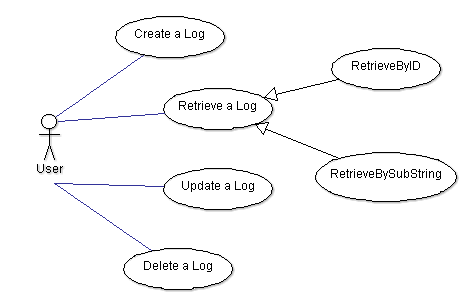
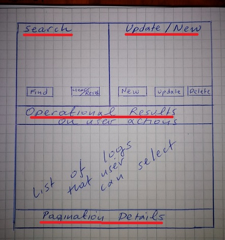
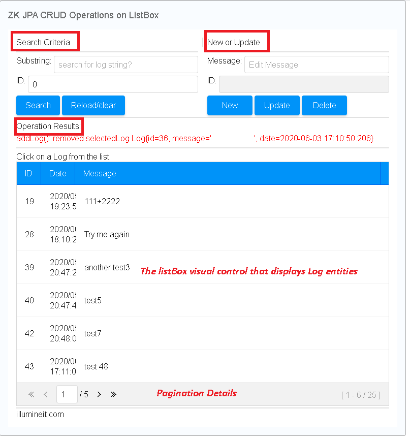
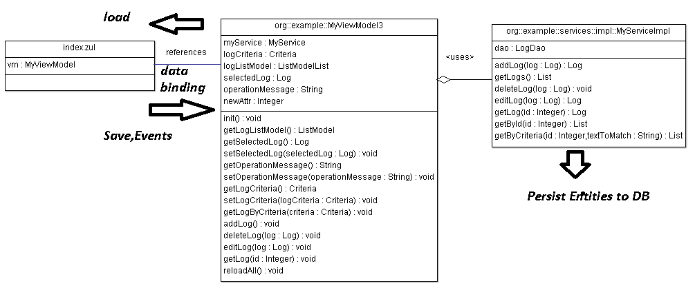
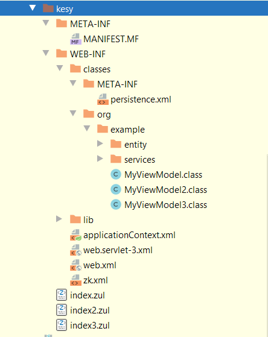
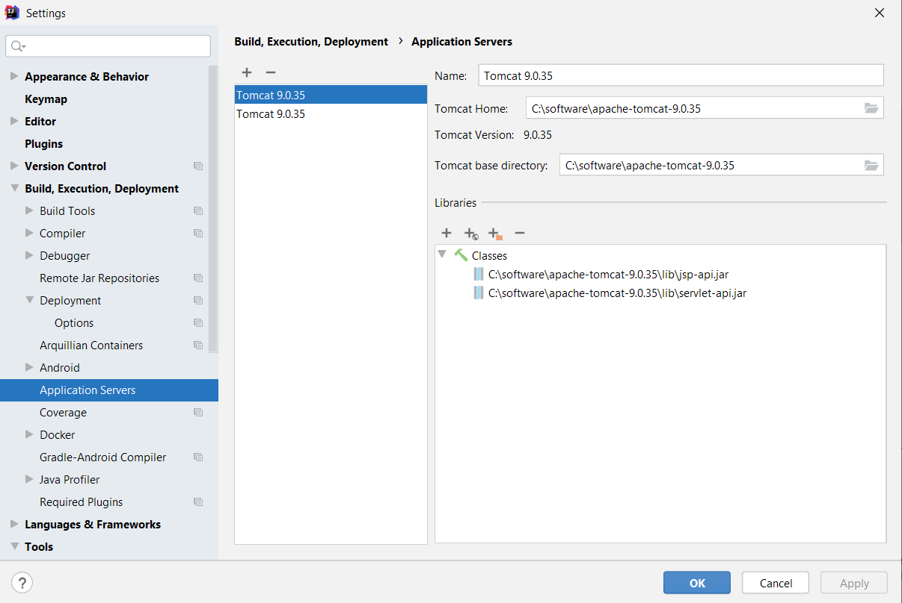

# ZK JPA Spring Tutorial with IDEA Maven
_by Michael Mountrakis, June 2020_


## Abstract
In this article we will implement a complete Web based example of 
[CRUD (Create, Retrieve, Update, Delete](https://en.wikipedia.org/wiki/Create,_read,_update_and_delete) 
operations on a database table.


To do so we will create a Web based form that allows the user to perform the CRUD operations. 


The Web form will be based on [ZK framework](https://www.zkoss.org/).


The design pattern we will follow to implement our application is the  [MVVM Pattern](https://en.wikipedia.org/wiki/Model%E2%80%93view%E2%80%93viewmodel)


In the service layer, the CRUD operations will be handled by [Hibernate JPA implementation](https://www.javaworld.com/article/3379043/what-is-jpa-introduction-to-the-java-persistence-api.html). 


The overall development will take place in [Intelij IDEA](https://www.jetbrains.com/idea/) and the 
build and dependency resolver tool we are using is [Apache Maven](https://maven.apache.org/). 


**The entire java source code, application descriptors, assembly files of this project are  available to download here: https://github.com/illumine/articles/tree/master/ZK-JPA-Spring-Tutorial-with-IDEA-Maven/src/main**

#### Keywords
Java, J2EE, Tomcat, ZK, ZK Framework, Web, Application, Spring, JPA, Maven, IDEA, Hibernate

## The Example Case
We use something very primitive: a simple Log. What is a Log? A message with a date! So, our simple application will offer the users
a simple Web form where the user can Create, Retrieve, Update and Delete a simple Log entry. 
This is a simple [UML Use Case Diagram](https://en.wikipedia.org/wiki/Use_case_diagram)
that describes the use-cases of our application:




The UML Use Case Diagram, practically illustrates the _Functional Specifications_ of our project.


## Designing the Web Form
Whenever you design a Web based application, regardless of its complexity, you always start with a pencil and a piece of paper!
Doing a non functional prototyping directly on the IDE using the framework you are  about to use, may lead you to an unclear design 
that does not lead to a correct, easy to use and handy Web form. For that reason back to the basics: pencil, rubber and paper:




Lets exmplain how we think of this paperwork design:
Basic form sections:\
* Search: is the section where the Retrieve operations take place. The user searches a Log entry with some _Selection Criteria._
* Udate/New: is the section where the user either Edits/Updates the current log, or Creates a new or Deletes the current. Actually 
this space on the form deals with the _Current Log_.
* List of Logs: is the form space where all the Logs are displayed. Initially some of them are displayed as a simple select from the Log table.
When user defines some Criteria 
and press Search/Find button, then this section displays the results of the search operation. 
When user clicks on a Log from the list, then this Log becomes
the _current Log_ and its details populate the section Update/New.
Help sections:\
* Operation Results: is the section where the user gets some _feedback or error messages_ are displayed.
* Pagination details: is the section that controls the List of Logs allows the user to move forward or backwards to the list etc...


In the next sections, we will implement the paperwork design to a Web form based on [ZK framework](https://www.zkoss.org/).


## Creating the Project in Intellij IDEA
The overal development will take place in [Intelij IDEA](https://www.jetbrains.com/idea/). 
You can download it from https://www.jetbrains.com/idea/download/


The reason that I implemented the article on IDEA is that this tool it is the leading platform at least in the time this article was written.
In my [previous ZK training](https://github.com/illumine/articles/tree/master/ZK-training), 
I use to work with Eclipse, but that was 5 years ago. I think IDEA needs some attention, nowdays it is the best of breed regarding Java development.


Read the official instructions from ZKoss in order to setup your in Intelij IDEA:


https://www.zkoss.org/wiki/ZK_Installation_Guide/Quick_Start/Create_and_Run_Your_First_ZK_Application_with_IntelliJ_and_ZKIdea


In my case, I came up to this error: _"Java: release version 5 not supported"_ but to resolve it I have
read the solution nr. 3 from [this article](https://dev.to/techgirl1908/intellij-error-java-release-version-5-not-supported-376)


According to this article, you have to perform  the following steps:


* Within IntelliJ, open pom.xml file

* Add this section before `<dependencies>` (If your file already has a <properties> section, just add the `<maven.compiler...>` 
lines below to that existing section):
```xml
   <properties> 
      <maven.compiler.source>1.8</maven.compiler.source> 
      <maven.compiler.target>1.8</maven.compiler.target> 
   </properties>
```

* Change the x in 1.8 to your Java version. For example, if you’re using Java 13, change 1.8 to 1.13

* Refresh maven


The project can be built with [this Maven POM file](pom.xml)

## The JPA Model of our Log Project
JPA is a Java Framework that persists Java Objects (or [JPA Entity Beans](https://en.wikipedia.org/wiki/Entity_Bean) as they sometimes refered) on a database or in general, to 
a local or a remote disk. The JPA implementation we are going to use is [Hibernate](https://hibernate.org/). 


So a simple Log entry as a plain Java Class can be like:


```java
    public class Log{
       Integer id;
       String message;
       java.util.Date date;
 
       public Log(){id=0; message=""; date= new java.util.Date(); }
     }
```


In order to transform it to a JPA Entiry Bean, the following Java Annotations are applied. See the file 
[Log.java](src/main/java/org/example/entity/Log.java)


```java
  @Entity
  public class Log implements Serializable, Cloneable {
	private static final long serialVersionUID = 1L;

	@Id
	@GeneratedValue(strategy = GenerationType.AUTO)
	Integer id;

	@Column(nullable = false)
	String message;

	@Temporal(TemporalType.TIMESTAMP)
	Date date;

	public Log() {
		this.date = new Date();
	}

	public Log(String message) {
		this();
		this.message = message;
	}

	public Integer getId() {
		return id;
	}

	public void setId(Integer id) {
		this.id = id;
	}

	public String getMessage() {
		return message;
	}

	public void setMessage(String message) {
		this.message = message;
	}

	public Date getDate() {
		return date;
	}

	public void setDate(Date date) {
		this.date = date;
	}
```


According to the DAO/Adapter pattern, the following components are used:

_Log_: the JPA Entiry Bean that is our actual data object. Consider each _Log_ object as a _Log_ table row.
See complete Java source file [Log.java](src/main/java/org/example/entity/Log.java)


_LogDao_: the Data Access Object, a class that implements methods for CRUD operations on the Log. Consider the _LogDao_ class as the _Log_ 
**table adapter**.
See complete Java source file [LogDao.java](src/main/java/org/example/services/impl/LogDao.java)


_MyService_: interface that denotes the DB Transaction methods.  Consider the _MyService_ interface as the  **DB adapter type library**.
See complete Java source file [MyService.java](src/main/java/org/example/services/MyService.java)


_MyServiceImpl_: the class implementing MyService interface. Consider the _MyServiceImpl_ class as the  **DB adapter**.
_MyServiceImpl_ actually, 
implements all the operations that are going/returning to the Database, it is the Database logic itself.

_MyServiceImpl_ is a collection of references of DAOs and Entities that are required in order to implement the transaction logic.
See complete Java source file [MyServiceImpl.java](src/main/java/org/example/services/impl/MyServiceImpl.java)


Bottom line of the _isolation_ design principle: 
whatever needs to deal with the Database, it requires a reference to  _MyServiceImpl_ object and no further
DB operations should take place out of this file.

Follows a UML Class Diagram of our design:


The JPA settings are defined in the file [persistence.xml](src/main/resources/META-INF/persistence.xml) where the HSQL DB is used to store the JPA entities.


```xml
  <?xml version="1.0" encoding="UTF-8"?>
  <persistence xmlns="http://java.sun.com/xml/ns/persistence" version="2.0">

	<persistence-unit name="myapp" transaction-type="RESOURCE_LOCAL">
		<provider>org.hibernate.ejb.HibernatePersistence</provider>
		<properties>
			<property name="hibernate.dialect" value="org.hibernate.dialect.HSQLDialect" />
			<property name="hibernate.connection.driver_class" value="org.hsqldb.jdbcDriver" />
			<property name="hibernate.connection.username" value="sa" />
			<property name="hibernate.connection.password" value="" />
			<property name="hibernate.show_sql" value="true" />
			<!-- data store in data/db under project folder -->
			<property name="hibernate.connection.url" value="jdbc:hsqldb:file:data/db" />
			<!-- db is not persistent to disk
			<property name="hibernate.connection.url" value="jdbc:hsqldb:mem:data/store" /> -->
			<property name="hibernate.hbm2ddl.auto" value="update" />
			<!-- drop table every time
			<property name="hibernate.hbm2ddl.auto" value="create" /> -->
		</properties>
	</persistence-unit>
   </persistence>
```


## The ZK Visual Design

Implementing the Graphical User Interface - the GUI - as most of us know it, includes the compilation of the 
ZK ZUL file that provides the presentation layer or the _view_ of our application. 
Recalling from the previous section _Designing the Web Form_
the implementation has as follows:




This is the [index3.zul](src/main/webapp/index3.zul) file.

As you can probably see, all the sections from the paperwork are placed in the Web Form exactly the same as in the paper work.

Some details around it:

We use several nested `hbox` and `vbox` layout managers to arrange the web form laout. 

See here for [ZK hbox](https://www.zkoss.org/wiki/ZK_Component_Reference/Layouts/Hbox)
and [ZK vbox](https://www.zkoss.org/wiki/ZK_Component_Reference/Layouts/Vbox)
 
 
The ZK visual input methods are `textbox, intbox, and datebox`


The Log entities are presented using a [ZK listBox](https://www.zkoss.org/wiki/ZK_Component_Reference/Data/Listbox).


## The MVVM Pattern Implementation of our Project
The [MVVM Pattern](https://en.wikipedia.org/wiki/Model%E2%80%93view%E2%80%93viewmodel) in abstract, it  has the 
following aspects:

1. Isolate the ZUL/XML presentation design - the _view_ -  from the rest of the code. 
The presentation design - the view - is the `index.zul` file.

2. The code that controls the  _view_  is called the _viewModel_ and in our case is the `MyViewModel3.java` file.
See the entire [MyViewModel3.java](src/main/java/org/example/MyViewModel3.java). The _viewModel_ is responsible to
provide the _view_ with the list of Logs, to set the current Log etc...

3. The _viewModel_ takes a single reference to an object of [MyServiceImpl.java](src/main/java/org/example/services/impl/MyServiceImpl.java) 
that holds all the business logic.

4. Wire the **Data Structures** of the Visual Components of the _viewModel_ to the _view_ or the ZUL file_ .
 The data structures  handled by the _viewModel_ class in the MVVM Pattern terminology is often called the **State**


5. Wire the **Methods** of the _viewModel_ to the _view or the ZUL file_ . The methods offered 
 by the  _viewModel_ class in the MVVM Pattern terminology is often called the **Behavior**
 
6. Wire the **Events** from the  _view / ZUL file_ to the _viewModel_. When an Event is trigered in the _view_ the corresponding
Method/Command from the _viewModel_ is triggered.


Lets examine how exactly the Wiring of MVVM State and Behavior from the **view / index.zul** file to the 
Java class implementing the **View Model** of our design

In the [index3.zul](src/main/webapp/index3.zul) file we can see the following sections:


```xml
    <zk>
           <window viewModel="@id('vm')@init('org.example.MyViewModel3')"
                 width="800px" border="normal" title="ZK JPA CRUD Operations on ListBox">
            ...
```


As you can probably see, the full class name `org.example.MyViewModel3` of the **viewModel** is specified.
Whith this declaration, whenever the `index3.zul` is initiated, the method `org.example.MyViewModel3.init()` is called.


In the ZUL file, we can refer to the Java class `org.example.MyViewModel3` using the variable `vm` that is specified in the
`id` section of the `viewModel` XML attribute.


Lets see the java _viewModel_ class: `org.example.MyViewModel3` 


```java
     @VariableResolver(org.zkoss.zkplus.spring.DelegatingVariableResolver.class)
        public class MyViewModel3 {

	        public class Criteria{
	    	.....
	        }

	 @WireVariable
	 private MyService myService;
	 private Criteria logCriteria;
	 private ListModelList<Log> logListModel;
	 private Log selectedLog;
     private String operationMessage;
     
     
     //Ommit Getters and Setters that you ALWAYS have to implement!
     
    @Init
	public void init() {
		List<Log> logList = myService.getLogs();
		logListModel = new ListModelList<Log>(logList);
		selectedLog = new Log();
		operationMessage = "";
		logCriteria = new Criteria();
	}
```


The annotation `@WireVariable`  states that all those attribute members of the `org.example.MyViewModel3` viewModel class
can be subsequently refered in the ZK .zul file with the use of the the variable `vm` specified in the
`id` section of the `viewModel` XML attribute.


Creating a ViewModel is like creating a POJO, and it exposes its properties like a JavaBean through setter and getter methods.
A ViewModel must always provides Getter and Setter methods to allow ZK engine access its State members! missing implementing the
getter/setter methods, will result in a runtime Exception when the artifact is deployed on the Application Server!


     
Lets take a look to the section of the ZUL file [index3.zul](src/main/webapp/index3.zul) dedicated to the Search Criteria of a Log entity:


```xml
      <vbox hflex="1">
                Search Criteria
                <separator orient="horizontal" bar="true"/>
                <hbox hflex="1">
                    Substring:
                    <textbox hflex="1" value="@load(vm.logCriteria.text),@save(vm.logCriteria.text)" placeholder="search for log string?"/>
                </hbox>
                <hbox hflex="1">
                    ID:
                    <intbox hflex="1" value="@load(vm.logCriteria.id),@save(vm.logCriteria.id)" constraint="no negative,no zero" />
                </hbox>
                <hbox hflex="1">
                    <button label="Search" onClick="@command('getLogByCriteria', criteria = vm.logCriteria )"/>
                    <button label="Reload/clear" onClick="@command('reloadAll')"/>
                </hbox>
            </vbox>

```


As we can see here, both  `textbox` and `intbox` load and save their content (their state) in the attribute members of view model class:
`@load(vm.logCriteria.text),@save(vm.logCriteria.text)` loads and saves to `org.example.MyViewModel3.logCriteria.text` and
`@load(vm.logCriteria.id),@save(vm.logCriteria.id)` loads and saves to `org.example.MyViewModel3.logCriteria.id`


Now on the seecond part: How  the **behavior** is wired from the zul file to the Java class? 
Notice the declaration of the handling of the `onClick` event: this wires the event to the method  
`org.example.MyViewModel3.getLogByCriteria` and binds the method's argument `criteria = vm.logCriteria` in other words
the `criteria` variable will take the actual state of  `vm.logCriteria`.

See the implementation of the method: `getLogByCriteria`:


```java
		@Command
		@NotifyChange({"operationMessage","logListModel", "selectedLog"})
		public void  getLogByCriteria( @BindingParam("criteria") Criteria criteria){
			if( criteria.getId() == 0 && Strings.isBlank( criteria.getText())  ) {
				operationMessage = "getLogByCriteria(): text is blank or id is 0!";
				return;
			}

			List<Log> logList = myService.getByCriteria( criteria.id, criteria.text);
			if( logList.isEmpty() ){
				operationMessage = "getLogByCriteria(): nothing found for " + criteria.toString();
				return;
			}
			selectedLog = logList.get(0);
			logListModel = new ListModelList<Log>(logList);
			operationMessage = "getLogByCriteria():  found selectedLog " + selectedLog.toString();
		}

```


The method is annotated with `@Command` meaning that this method is handling some event that is wired from the ZUL view.
When this method is called and finished, the state variables `{"operationMessage","logListModel", "selectedLog"}`
of the ZUL view are notified thus are reloaded from the ViewModel class!



More on view model:\
ZK implementation of the MVVM pattern:\
http://books.zkoss.org/zk-mvvm-book/8.0/viewmodel/index.html

The MVVM pattern in ZK: a complete example\
https://www.zkoss.org/wiki/ZK_Getting_Started/Get_ZK_Up_and_Running_with_MVVM


## The deployment descriptors
The Java application server we want to deploy our example is [Apache Tomcat](http://tomcat.apache.org/)
To do so the following descriptors are used:



Lets walk one by one of them:

[applicationContext.xml](src/main/webapp/WEB-INF/applicationContext.xml) defines 
the JPA / Hibernate  configuration and defines out application base Java package where 
Spring framework will be enabled. This is required descriptor!


[web.servlet-3.xml](src/main/webapp/WEB-INF/web.servlet-3.xml)  Optional descriptor in case your application defines 
[Servlets](https://en.wikipedia.org/wiki/Java_servlet)


[web.xml](src/main/webapp/WEB-INF/web.xml)  Required descriptor that  defines almost all components of your Web application, like :


* Web Application Name
* Spring configuration , spring context
* ZK loader for ZUML pages, ZK listener for session cleanup
* MIMEs and file extensions
* Welcome Files and priorities

[zk.xml](src/main/webapp/WEB-INF/zk.xml)  Required ZK descriptor that  defines optional parameters. 

## How to Build the project

1. Clone this repository using command
```
git clone https://github.com/illumine/articles
```


2. Read and reproduce the official instructions from ZKoss in order to setup your in Intelij IDEA:


https://www.zkoss.org/wiki/ZK_Installation_Guide/Quick_Start/Create_and_Run_Your_First_ZK_Application_with_IntelliJ_and_ZKIdea

Name your new ZK  project as `zktest`


3. Copy the folder [src](https://github.com/illumine/articles/tree/master/ZK-JPA-Spring-Tutorial-with-IDEA-Maven/src/main) from the cloned project to your new ZK project
`src` directory.


4. Copy the file [pom.xml](https://github.com/illumine/articles/blob/master/ZK-JPA-Spring-Tutorial-with-IDEA-Maven/pom.xml) to your project


5. Run the Maven using the [pom.xml](https://github.com/illumine/articles/blob/master/ZK-JPA-Spring-Tutorial-with-IDEA-Maven/pom.xml) to your project


## Tomcat Deployment on IDEA, how to run the project

To deploy the application on [Apache Tomcat](http://tomcat.apache.org/), 
you must first download and [install Tomcat](https://tomcat.apache.org/tomcat-8.5-doc/setup.html) in a directory on your system.


Then register Tomcat application server to the IDEA.
You can do so, by accessing IDEA Settings:





Then create a runtime for the server and deploy the project on it:


Run the project: IDEA Main Menu - Run - Run Tomcat x.x


Open with the browser the following URL:
http://localhost:8080/zktest/index3.zul


## Resources and References

### UML Resources
[UML](https://en.wikipedia.org/wiki/Unified_Modeling_Language)  Use-Case and Class Diagrams of this project 
were compiled with source code reverse engineering from [ArgoUML](https://sourceforge.net/projects/argouml/)

The entire [ArgoUML](https://sourceforge.net/projects/argouml/) project can be also downloaded here:
[ZkMvvmPattern.zargo](ZkMvvmPattern.zargo)


### ZK With Maven, JPA, Spring using IDEA
Project setup in Intelij IDEA:\
https://www.zkoss.org/wiki/ZK_Installation_Guide/Quick_Start/Create_and_Run_Your_First_ZK_Application_with_IntelliJ_and_ZKIdea


IntelliJ - Error:java: release version 5 not supported \
Select the solution #3\
https://dev.to/techgirl1908/intellij-error-java-release-version-5-not-supported-376


### MVVM Patern in ZK
ZK implementation of the MVVM pattern:\
http://books.zkoss.org/zk-mvvm-book/8.0/viewmodel/index.html

The MVVM pattern in ZK: a complete example\
https://www.zkoss.org/wiki/ZK_Getting_Started/Get_ZK_Up_and_Running_with_MVVM

